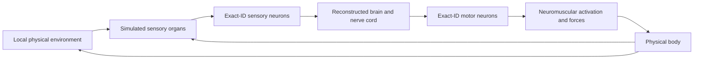

# Proposed BANC sensory-to-motor architecture, v1

2026-10-08. Status: **assessment proposal, not implemented or an executable scientific protocol**. Governing direction: [GOALS.md](../../../docs/GOALS.md). Evidence and remaining gaps: [RESULTS.md](RESULTS.md).

## The intended causal loop

Only organ-local measurements enter the sensory adapter. Neural outputs act through documented motor targets, activation dynamics and physical forces. The viewer reads recordings from this loop. Hidden food/predator coordinates, navigation routes, challenge scores and a hand-designed desired turn are not neural inputs.

The current FlyWire application remains available with its existing controller identity. Its supplied gait generator and engineered escape behavior remain separate diagnostic controls. They must not be silently retained behind a label claiming native nerve-cord motor control.

## 1. Dataset package before dynamics

Create a separate `banc-v888-archive3-detector-v2` source package rather than replacing the FlyWire files in place. Keep data, annotation revision, code and preprocessing identities separate. Use `(dataset, materialization, source hash, exact ID)` throughout; serialize IDs as strings.

Register an import-only audit before downloading the graph/site archives. Pin archived file IDs, lengths, MD5 and independently computed SHA-256. Read batches rather than materializing all original strings and derived copies together. Preserve interruption receipts and enforce the 2 GiB reserve. Keep one import worker initially.

Produce explicit rosters for accepted neuronal identities, excluded non-neural rows, uncertain membership and unresolved endpoints. Missing annotations are not grounds for silently excluding a neuron. Proofreading flags are QC metadata, not a universal membership rule. Resolve the two `root_888` conflicts and generic-ID divergence against the release key and upstream provenance.

Audit every graph endpoint and weight, duplicates, self-connections, and anatomical-site totals. Do not import `norm` as a physiological conductance or assume `count` has electrical units. Verify the simple-table omissions against a complete supported representation and recover supported autapses. Treat v3 as an independent candidate after v2 source replication. Record exclusions and unsupported electrical/gap-junction information explicitly.

Use MaleCNS for separately identified route comparisons. An NBLAST match, shared cell type or coordinate transform cannot make its body IDs into BANC roots. No old learned weights, adaptation states or brain checkpoints transfer automatically across specimens.

## 2. Physiological assumption registry

Every cell-model family and synaptic-effect class gets a versioned entry containing its source measurement, matching confidence, units, equations, parameter range, uncertainty and validation status. Distinguish measured cell-specific values, class-level measurements, cross-specimen estimates and explicit priors. Never label unmeasured default parameters as recovered biophysics.

Support spiking and graded cells together. Use voltage/conductance units for neuronal dynamics, seconds for simulation time and Hz for firing rate; dimensionless activation only after a named transduction step. Separate sensory receptor adaptation, spike-frequency adaptation, synaptic depression and learning. Do not copy the old 450 ms/13.5 mV cooldown to a new class without validation.

For synapses, resolve transmitter and postsynaptic-effect assumptions separately. Retain multiple transmitters and uncertainty. Model fast receptor-mediated conductance separately from slow modulation. Do not assign every glutamatergic connection an inhibitory sign or every dopaminergic connection an immediate excitatory impulse. Unknown effects require named assumptions/sensitivity fixtures, not random assignment.

First validate family equations on isolated numerical fixtures: analytic decay/current response, timestep convergence, spike reset/refractory rules, graded transfer, event ordering, continuation and units. Then compare matched published response data. Freeze accepted calibration choices before new-seed/full-network validation. Fitting to measured physiology is distinct from fitting to game reward.

## 3. First body loop: one measured leg response

Begin with controlled front-leg femur–tibia movement in a tethered or supported body. Start with the claw position route; add hook velocity and club movement/vibration only after their input and response mappings are checked. Do not claim individual-cell tuning from a shared subclass label.

Map physiological recorded cell groups to exact BANC roots using morphology, side, neuromere and connectivity. The 440 `13B` hemilineage annotations do not by themselves identify 13B-alpha. Inspect named flexor/extensor targets and the body's actual joint axes, muscle moment arms and force conventions. Grouping motor neurons onto one artificial joint actuator is an engineered approximation and must be labeled.

Use physical joint angles/velocities and later local loads to drive explicit organ response models. Test stimulus → sensory activity → interneuron response → motor activation → body response → renewed sensory measurement. Begin with imposed movement; then allow the measured feedback route to act. Retain body-only and supplied-gait controls. A successful posture response does not establish walking.

Run the relevant response again in the full supported neuronal graph before making a whole-network claim. Diagnose differences from the fixture without deleting unexpected recurrent inputs to meet the target.

## 4. Full model, scheduler and operational gate

Keep the existing neural/body interface contracts where they are adequate; implement the new model in separate modules and manifests. Store family-specific persistent state, receptor/activation state, delayed events, organ state and random generators. Restore only when graph, mappings, equations and checkpoint schema identities match.

Use one simulation clock and a causal schedule. Sensory samples at time t can affect subsequent neural evolution and physical forces; never use future body frames or trial outcomes to drive earlier activity. Choose neural/physics timesteps from convergence and relevant response bandwidth, then pin them. Rendering and export cannot advance dynamics independently.

Benchmark import, 10 simulated seconds of full neural activity, body and combined loop. Measure total application memory and peak import memory, event/recording overhead, free space and simulated seconds per wall second. Target below 10 GiB total footprint on this 16 GiB Mac. If it fails, report the diagnosis and retain exact state/evidence; do not silently substitute a reduced interactive network. Recorded playback remains the default when slower than real time.

## 5. Walking and native steering

Expand posture/feedback to six legs and local load/contact sensors. Connect motor-cell activity to named muscle/actuator models, not a two-number forward/turn decoder presented as leg control. Demonstrate standing, initiation, stopping, coordination, turns and perturbation recovery; log falls/stalls without teleportation.

Use published descending-neuron activity/behavior measurements to qualify steering in the appropriate context. A DNa route is tested through its downstream cord and body effects. Raw PN subtraction is retained only as a diagnostic comparison. A future native-route acceptance protocol must state why its observables differ from the historical evaluator; this is a **new scientific protocol**, not a bug fix or retroactive pass for old failures.

## 6. Genuine sensory channels

Odor: sample concentration at physical antenna sites; add matched receptor-specific dose/temporal response, latency and adaptation. Establish meaningful concentration units or explicitly label synthetic units. Validate held-out stimuli and then new food-source positions. No coordinates or favored heading enter the brain.

Vision: calibrate actual eye images, optics/retinotopy, brightness, motion and own-body masking. Missing receptor/lamina tissue needs an explicit reconstructed or physiological module. Any Flyvis-derived model is a separately pinned fitted/composite component. Validate flashes, edges, optic flow and looming with occlusion controls before predator integration. Preserve fixed stimulus-to-camera geometry and coordinate units.

Touch/proprioception: distinguish bristles, campaniform sensilla, hair plates and chordotonal organs. Generic collision flags are engineered event adapters until their physiological mapping is qualified. Restore ascending feedback rather than giving the brain privileged global body/world state.

## 7. Reconnect the garden and learning

After walking and sensory action meet their own gates, reintroduce open-ground food, obstacles, shelters and the engineered predator in that order. Use the existing local-field world and recording/editor infrastructure where verified. Predator visibility belongs to sensory physics; navigation knowledge stays inside the predator controller.

Qualify food contact, taste/reward routes and aversive events separately. Resolve exact mushroom-body compartments and the ambiguous MBON01 mapping before transferring any learning hypothesis. Establish response, action and frozen baseline first; then register acquisition, retention, reversal and generalization with the original minimum 20 matched independent states, frozen/shuffled controls and required bootstrap/reversal criteria. Game energy is still a simplified variable.

Capture retains learned parameters while resetting trial/body/transient state. Full checkpoints remain distinct from videos. Flight follows walking and needs separate wing/haltere/aerodynamic validation; [FlyBody](https://github.com/TuragaLab/flybody/tree/d015e9bfe441bd90ae431bac24c55cb74bdbce26) is a future physical-platform candidate. Its stock trained controllers cannot establish neural flight control.

## 8. Recordings, anatomy viewer and honest delivery

Create a model-versioned recording schema containing spike events **and bounded continuous samples for graded cells**, muscle activation and organ-local measurements. A graded cell with no spikes can still be active; a spike-only heat map must not depict it as physiologically silent.

Join new morphology by exact dataset/release ID, verify units and alignment on a sample, cache hashes and display missing coverage. Existing FlyWire branches cannot become BANC neurons by type-name matching. Branches share their cell's recorded activity; no invented electrical waves.

Retain raw recordings, complete checkpoints and synchronized free-camera playback/MP4 export. Annotate supplied controllers, composite sensory modules, unknown physiology and model coverage. Before delivery, exercise actual launch, browser controls, pause/edit/save/branch, restart, interrupted jobs and deterministic replay with this model. Report runtime, anatomical coverage, physiology validation, neural body control and learning separately.

## Concrete deliverables before the next scientific run

1. A frozen import-only protocol, separate source package and membership/edge audit manifest.
2. A physiology-source parser and exact-root correspondence roster for one leg-feedback response; unresolved matches remain unresolved.
3. A proposed numerical model-family registry and diagnostic tests, with explicit assumptions and units.
4. A registered small leg-response protocol with exact stimuli, timesteps, metrics, calibration/validation partition, seeds and stop rules.

This design authorizes no simulations by itself. Execute only after these concrete dependencies exist; no new exhaustive parameter sweep is proposed.
