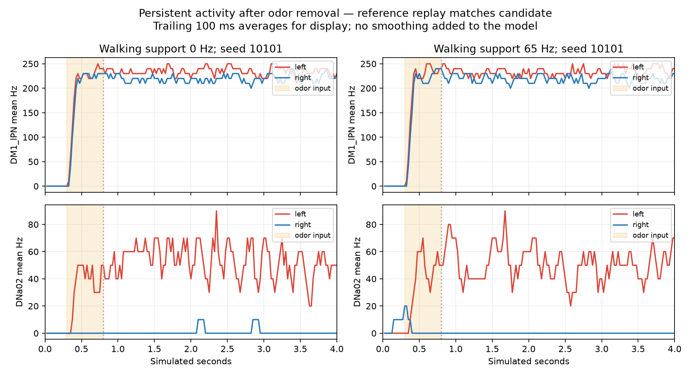

# Neural model/interface review

## Completed work

40 new full-network trials: eight extended reference/candidate simulations, eight direct MBON32 capability diagnostics and 24 prospectively registered global-strength variants. All source/data identities and raw-event/count/decoder audits pass. Learning is off; the application and original imported network are unchanged.

## Extended reference comparison

Four matched pairs, two disjoint seeds and support0/65Hz, run4 simulated seconds with odorA5Hz/root only during.3–.8s. All160 windows per pair match individual spike IDs/times/counts and input events exactly; selected voltage/g match within the prior1e-10mV absolute tolerance. Shared external-event construction replaces native PoissonInput and the redundant original reset w=0 is omitted as in the previous equation replay. This is a bounded equation-level reference comparison, not published behavior or full native-stochastic equivalence.

| Seed | Support Hz | Final .5s DNa02 L/R Hz | Final .5s DM1 PN L/R Hz |
|---:|---:|---:|---:|
| 10101 | 0 | 46.0/0.0 | 234.0/222.0 |
| 10101 | 65 | 54.0/0.0 | 238.0/220.0 |
| 10102 | 0 | 46.0/0.0 | 236.0/224.0 |
| 10102 | 65 | 48.0/2.0 | 228.0/218.0 |

Stimulated DM1 ORNs are quiet in the final .5s, yet downstream activity persists. Some unstimulated DM2 ORNs show low recurrent activity; do not claim all receptors are silent. Persistence is reproduced by independent released-equation construction under these inputs, so an adapter-only explanation is unsupported for these cases. This does not prove every integration component correct or identify a unique biological cause.

## Downstream pathway capability

The literature proposes MBON32 participation in learned appetitive/aversive steering and supports the bilateral DNa02 difference readout: [Rayshubskiy et al.](https://elifesciences.org/articles/102230). It does not validate a uniform DM1/DM2-to-ipsilateral-turn transformation in this generic model. Exact MBON32 roots were directly stimulated at50Hz with matched65Hz support. These are capability tests, not sensory inputs or navigation.

| Seed | Pulse change L cue / R cue / both (Hz) | Recovery gate | Directional capability |
|---:|---:|---|---|
| 10201 | 4.0/0.0/4.0 | True | False |
| 10202 | 6.0/0.0/6.0 | True | False |

Direct MBON32 does not provide the registered mirrored response under these conditions. This does not prove MBON32 has no role in natural behavior. Preserved effective-delivery diagnostics implicate inhibition in right-DNa02 suppression, while the new anatomical/presynaptic tail rankings are hypotheses only. No inhibitory lesion or sensory-to-motor bypass is installed.

## Explicit model parameter variants

[Shiu et al.](https://www.nature.com/articles/s41586-024-07763-9) tested global synaptic strength±30% for robustness of their specific predictions. We prospectively test0.7/1/1.3 strength with no odor/left/right/bilateral stimuli on seeds10301/10302. All neuron/connection counts and signs are retained; full weight fingerprints remain fixed during trials. These are altered model parameters, not original-model equivalence. Decoder/support stay fixed.

The global-strength capability gate fails for every tested strength. No candidate is frozen or promoted; held-out physical navigation is not started.

See [parameter results](synaptic-scale-calibration-v1/RESULTS.md) for every gate and retained failure.

## Decision

Stop unstructured odor-gain and global-strength sweeps. The next justified research phase is a source-backed neural-dynamics/operating-state revision with an independently validated reference case, followed by the same direction/recovery gates. Candidate mechanisms such as heterogeneous intrinsic dynamics, receptor-specific responses or adaptation must be supported and tested, not invented to force steering. A revision must get a new model identity and clearly list all differences. Preserve the released model as a reference and keep full-network coverage; no reduced network substitution. Navigation, biological fidelity and learning remain unvalidated.

The parent garden plan remains active. This package resolves a narrower question about tested persistence and interface capability; it does not complete the application, research or delivery acceptance.

## Runtime

Trial timers total 703.4 wall seconds; peak trial worker RSS 2.66 GiB. Excludes startup outside timers, read-only audits and plotting. Raw recordings retained.
