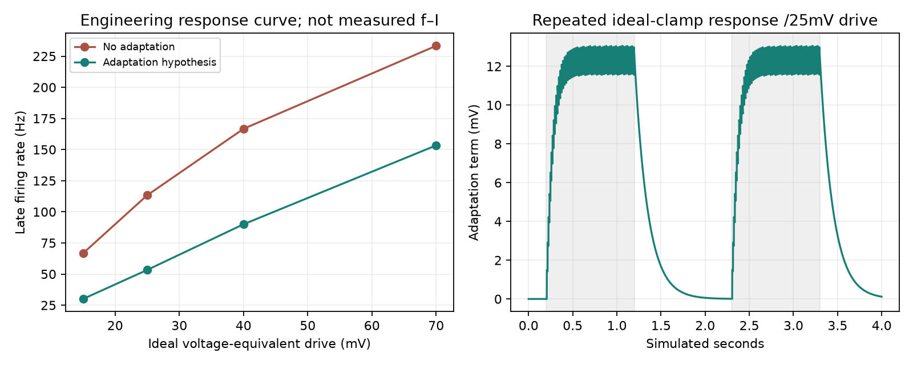

# Isolated adaptive-LIF reference

Four tests and five numerical/dynamic checks pass. This is a voltage-equivalent adaptive-LIF hypothesis with zero subthreshold coupling,150-ms adaptation decay and1.5-mV spike increments. It is not calcium/potassium-channel physiology, an experimental fly-cell fit or full-brain acceptance.

With an ideal25-mV clamp into the modeled g variable, first onset rate is90Hz, late rate53.33Hz, and repeated onset90Hz. The unadapted cell is110/113.33/110Hz. Off intervals remain quiet. The ideal clamp resets g each step and is explicitly an engineered test input, not measured injected current. Other drive levels are retained in results.json.

Exact linear subthreshold solution errors across100,50,25-microsecond clocks are at most6.3e-13mV. Adaptation decays through refractory intervals and accumulates on repeated spikes. Pending-event checkpoint continuation is exact with nonzero adaptation. Zero-adaptation event parity matches the two-state reference. Invalid masks and parameters are rejected.

The initial failed checkpoint assertion compared a physical quantity against a dimensionless array. The original test and log are retained. Only the comparison representation was corrected; no state tolerance or model parameter was relaxed. A uniform adaptation time constant is declared shared to allow common coefficients; the pre-shared declaration source is preserved.

Full-network zero-adaptation checks and domain calibration are separately recorded in ../adaptive-domain-screen-v1. No live controller change or parameter sweep completion is claimed.

