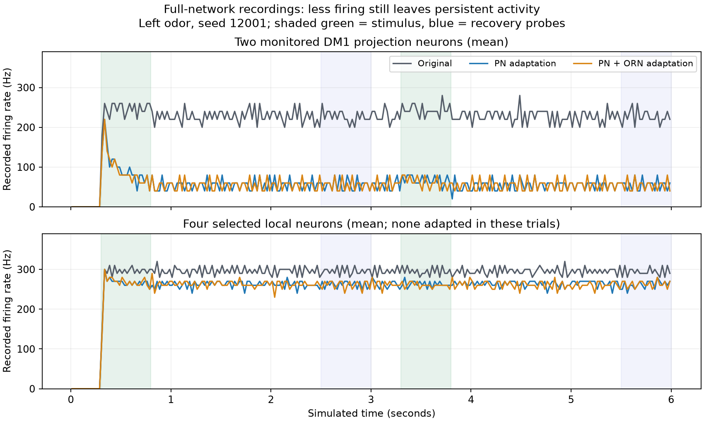

# Adaptive feedback attribution

Completed a new offline trace of 24 existing full-network recordings: original, strongest PN adaptation, and strongest PN+ORN adaptation; both seeds and all four cue conditions. All 5,760 input chunks passed SHA checks. No new full-brain simulation or controller modification was performed.

The six exact targets are the two selected DM1 projection neurons plus four previously selected local neurons. Every recorded g and adaptation endpoint was reconstructed from delayed, signed incoming events and observed spike/reset/refractory timing. Maximum g error: 7.96e-13 mV; maximum adaptation error: 4.15e-12 mV, both below the registered 1e-10 mV bound. Recorded-spike-derived gates match the replay exactly. This reconstruction uses observed spikes; it does not independently predict voltage or spike times. The separate native reconstruction in the feedforward package does predict selected spikes.

During both recovery windows across both seeds and all three odor conditions, ALLNs supply 97.52–98.21% of accepted positive PN increments in the original arm. Under the strongest adaptation in either domain, their share is 99.33–99.42%. PN firing drops from 220–238 Hz to 50–58 Hz, while the four unadapted selected locals continue at 226–278 Hz. ALLN sources also dominate most selected-local positive input; one selected type retains a larger projection-neuron contribution.

These numbers are signed voltage-equivalent synaptic increments, not biological membrane currents. They describe delivery under the recorded refractory gates. Percentages alone do not establish causal importance or prove a unique autonomous loop. Earlier projection/local transport-cut experiments supply separate conditional causal evidence; their wiring cuts are diagnostics, not deployable repairs.

Per-target/per-phase class totals and exact-root top positive/negative sources are preserved in results.json. Pre-gate arrival trains are saved per trial; an altered neuron model must recompute its own gate rather than reuse accepted increments. The four selected locals are monitored examples, not the entire relevant population.

Runtime: 32.40 wall seconds. Peak process RSS: 1.027 GiB. All pinned source and manifest hashes were reverified after execution. Six meaningful helper tests passed for signed impulses, delays, filtering, refractory release, chunk-boundary resets, and adaptation decay.

Reproduce in a separate empty output directory with the pinned script scripts/trace_adaptive_feedback.py. The default script refuses an existing output folder to protect completed evidence. Do not delete evidence to rerun it; select a new versioned output package.
