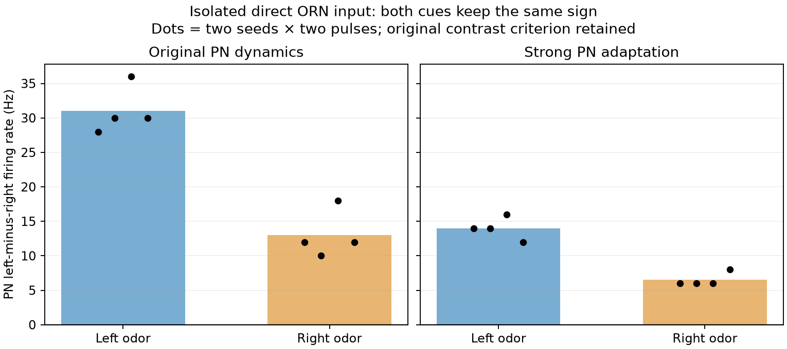

# Isolated DM1 feedforward diagnostic

The diagnostic removes recurrence to ask whether the chosen two-neuron difference is inherently an opponent left/right signal. This is a reduced two-unit test, not a replacement controller, full-brain mode, or learning evaluation.

The protocol was written and hashed before diagnostic execution. Eight original full-network recordings supplied exact DM1 receptor-neuron spike trains, shared between original and strongly adaptive PN dynamics. Exact anatomical signed weights and the 1.8 ms delay were retained. All other incoming connections, body dynamics, descending output, support and learning were absent. Recorded ORN trains can include feedback from their original parent run; this is an intervention on the replayed PN input, not an independently simulated receptor system.

Before these 16 feedforward runs, six native Brian2 reconstructions used pre-gate full recorded input into the two PNs and four selected locals. Original and both strong adaptation domains were checked for both left-cue seeds. Predicted target spike ticks and 25 ms counts exactly matched all six parent recordings. g and adaptation state errors were below 1e-10 mV. Gates were recomputed from the new native dynamics, not forced from recorded spikes. Voltage endpoint equality was not included in this acceptance claim.

Direct anatomical site totals into [left PN, right PN]:

| Source | Receptor neurons | Left PN | Right PN |
|---|---:|---:|---:|
| ORN_DM1 left | 35 | 2,064 | 1,183 |
| ORN_DM1 right | 33 | 1,664 | 1,288 |

Both source populations have more total modeled positive anatomical sites into the selected left PN. This is an imported wiring property, not evidence of an ID swap or a sign bug. Site totals alone do not guarantee spike-rate ordering; the replay tests the resulting rates.

All 24 stimulated pulse/recovery comparisons returned to zero PN excess in the existing [2.5,3.0) and [5.5,6.0) recovery windows. Neither dynamics variant satisfied any of the eight original Gate 3 comparisons:

| PN dynamics | Left cue: left-minus-right | Right cue: left-minus-right |
|---|---:|---:|
| Original | 28–36 Hz | 10–18 Hz |
| Strong adaptation | 12–16 Hz | 6–8 Hz |

Both cues therefore keep the same sign despite removal of recurrent input. Some cue information remains in response magnitude, but these two calibration seeds do not establish robust direction decoding, generalization, embodied navigation, or gradient performance. A spontaneous sign reversal is not established by anatomical left/right labels. The frozen opponent criterion remains unchanged and failed; no bias subtraction or fitted decoder was applied.

Runtime: 26.01 wall seconds. Peak process RSS: 0.714 GiB. All parent chunk hashes and pinned sources were verified. No full-brain simulation ran and no production controller changed.

Results, anatomy, native reconstruction receipts, compressed input trains and trial traces remain local in this versioned package. The default script refuses an existing output directory to preserve evidence.
