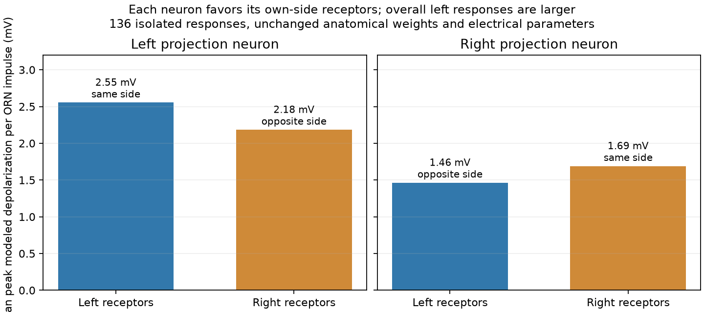

# DM1 single-input response and the raw PN difference

2026-10-07. The original point-neuron model preserves an ipsilateral input advantage within each selected PN. A larger overall effective input scale for the left PN confounds a raw cross-PN difference. This refines the earlier two-PN feedforward diagnosis; it does not change its recorded results.

The test uses **136 independent PN replicas**, representing each of 68 exact DM1 ORNs onto both selected PNs. Each replica receives one incoming jump at 20 ms with its existing signed anatomical weight, then runs for 100 ms on the original 0.1 ms clock. No recurrent circuit, weight normalization, decoder fitting or compensation is introduced. All 136 responses remain subthreshold. Their maximum discrepancy from the closed-form impulse response is **9.82e-14 mV**.

| Target PN | Receptor side | ORNs | Total anatomical sites | Mean sites per ORN | Mean unitary peak |
|---|---|---:|---:|---:|---:|
| Left | Left (ipsilateral) | 35 | 2,064 | 58.97 | 2.554 mV |
| Left | Right | 33 | 1,664 | 50.42 | 2.184 mV |
| Right | Left | 35 | 1,183 | 33.80 | 1.464 mV |
| Right | Right (ipsilateral) | 33 | 1,288 | 39.03 | 1.690 mV |

The left PN responds more strongly to left than right receptors, and the right PN more strongly to right than left receptors. However, the left PN responds more strongly than the right PN to **either** receptor side. Thus useful side information is present; simply subtracting the two raw PN rates can mix it with unequal effective input gain. This is not evidence of a root-ID swap or proof that side information was erased.

In biological DM6 microcircuits, dendritic geometry and input resistance can compensate for different numbers of ORN sites. That is a plausible omitted mechanism, not a measured cause or numerical fit for these DM1 roots. Whole-cell skeleton cable length is insufficient for a capacitance or dendritic correction. No bias subtraction or gain adjustment is applied here. [Tobin et al., 2017](https://elifesciences.org/articles/24838).

DM1 unilateral stimulation and PN recordings support real olfactory lateralization, while descending-neuron firing differences have separate functional evidence for turning. Neither result guarantees that this particular raw PN difference or synthetic odor mapping yields navigation in our point-neuron model. The unchanged DNa02 motor decode must be tested directly after recovery is repaired. [Gaudry et al., 2013](https://wilson.hms.harvard.edu/sites/g/files/omnuum8421/files/wilson-lab/files/gaudrywilson2013.pdf), [Rayshubskiy et al., 2025](https://elifesciences.org/articles/102230).

The package took **2.50 seconds**, with **0.631 GiB** peak RSS. The protocol, individual-response table, raw traces and exact numerical reference are preserved. No full-network run or production change occurs here.
