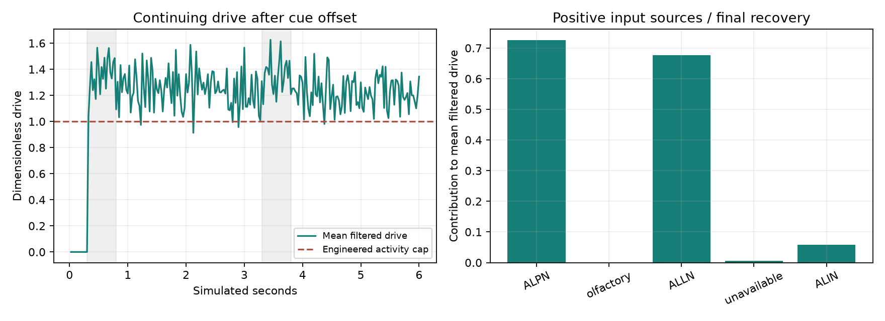

# Persistent feedback trace

Analyzed 16 completed original/adaptation-free local-inhibition recordings without running a brain trial or changing a parameter. Three helper tests pass. Native refractory gates for both DM1 PNs match exactly across 40,000 ticks each in an earlier recorded native diagnostic.

The eight local-candidate recordings replay from saved spike events, full anatomical routing and the frozen dynamics. Incoming filters agree within 3.55e-15; local activity agrees within 6.66e-16. This establishes that continuing local activity is reconstructed from continuing network input rather than stale recording/display state.

During both recovery windows across both seeds and all three odor conditions, annotated ALLNs supply 97.50–98.22% of accepted positive modeled voltage increments reaching DM1 PNs. Commanded new local inhibition is 1.27–1.38% of those positive increments. These are voltage-equivalent increment accounting quantities, not biological membrane currents; their ratios alone do not establish causal influence because timing and gating differ.

Late input into mapped DM1 local units is dominated by annotated projection/local sources. The olfactory-class contribution is effectively absent in the recovery windows. Earlier causal interventions on the original model separately support conditional dependence on projection/local transport groups; this new trace is descriptive and does not prove a uniquely sufficient feedback loop.

Exact-root top-source rankings and class contributions are retained per PN, trial and phase in results.json, including unavailable annotations. No unannotated neuron is assigned to a convenient biological class. All source hashes and recording chunk hashes were checked. Full replay took 33.63 seconds and peak RSS was 1.91 GiB.

The next candidate can test intrinsic adaptation in projection neurons and separately qualified local/olfactory domains. It must preserve wiring, use a separate calibration seed, retain repeated-pulse response and existing recovery/contrast criteria, and treat every parameter as a hypothesis. AdLIF and local-inhibition mechanisms remain separate. Do not change signs, delete feedback connections or increase local gain merely to force these recordings to pass.

