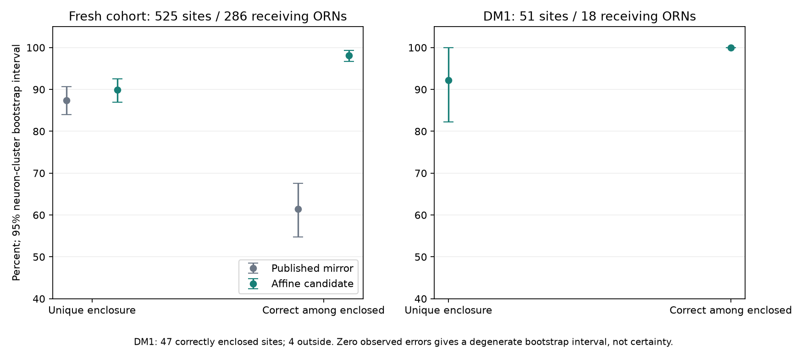

# Fresh shape registration and partial anatomical binding

The bounded affine candidate passed the frozen pooled and DM1 confidence gates. It resolves the current DM1 anatomical registration bottleneck, not the neural recovery problem. No application controller, learned weights, neuron signs or physiological compartments were changed.

| Fresh PN-to-ORN cohort | Published mirror | Affine candidate |
|---|---:|---:|
| Unique enclosure, 525 sites | 87.43% | 89.90% |
| Correct label among uniquely enclosed | 61.44% | 98.09% |
| Correct label among all sites | 53.71% | 88.19% |
| Outside / overlapping | 66 / 0 | 42 / 11 |

Affine unique-enclosure 95% neuron-cluster bootstrap interval: 86.94–92.53%. Conditional label interval: 96.68–99.33%. DM1: 47 of 51 sites correctly and uniquely enclosed, four outside, across 18 receiving ORNs. DM1 enclosure interval: 82.22–100%. Its conditional-label bootstrap interval is [100%, 100%] because no included errors were observed; this finite sample does not demonstrate universal accuracy.

## Frozen design and independence

82,157 calibration sites from calibration ORNs to cognate uniglomerular PNs supplied equal-neuron-weight centroids and covariances. The positive-definite covariance transport was bounded to principal scales 0.5–2.0, with minimum five calibration neurons and 50 sites per side. The 47 fitted transforms were frozen before opening fresh probe positions. No acceptance threshold, connection count, root ID or manually selected neuron index was changed. The initial float-coordinate implementation error happened before fitting and before opening the probe; original source, logs and repair provenance are preserved.

The new cohort comprises 525 cognate uniglomerular-PN-to-held-out-ORN sites in AL_R. Source class and source synapse IDs are fresh and disjoint from the previous ORN-to-PN and ORN-to-ORN probes. Some receiving ORNs can also occur in previous probes: this is a fresh synapse-class test, not new animals or entirely independent neurons. Bootstrap sampling clusters by receiving ORN. This candidate was not selected by outcomes on the earlier inspected probes.

Only DM1 and DP1m have adequate individual samples and pass their confidence gates. The pooled result does not validate every one of the 47 fitted regions. No manual boundary validation was performed. The transformation is an engineered registration of an existing atlas, not a newly published biological right-side atlas.

## Count-preserving mapping

All 179,560 directional endpoints and all 68 root/direction totals are retained. 92,542 endpoints have eligible anatomical assignments across the native left atlas and individually eligible right DM1/DP1m. 58,151 remain unavailable for regional evidence, 25,275 are outside, and 3,592 overlap. All fitted neighboring meshes remain in membership tests, including unvalidated neighbors, so removing competitors cannot inflate coverage.

Right DM1 contains 2,667 unique endpoints. `right-DM1-counts.csv` records exact root and input/output counts. `partial-anatomical-bindings.json` joins all 34 exact root IDs to the original model indices, annotations and count allocations. Unavailable sites are preserved, not dropped or silently reassigned.

## Local inhibition requirements

The source annotation has known GABA/MIP annotations for the 12 lLN2P_b roots. The 13 lLN2P_a and nine lLN2P_c roots have empty known-transmitter fields; predictions remain separate. These annotations support a type-level bridge, not a direct measurement of each modeled neuron.

The previously reproduced continuous reference is fitted for LN2P_c/DC3. Its state and release variables are proxies; its fitted time constant and gains cannot be presented as measured DM1/lLN2P_b physiology. Skeleton connectivity and spatial bins also do not establish electrical isolation. `local-inhibition-contract.json` lists the unresolved conversions, units, target mechanisms, coupling and peptide/receptor treatment. All physiological parameter values remain null.

The next work is to freeze an explicitly qualified candidate adapter, validate isolated dynamics and continuation, and then compare it with the unchanged full-network diagnostic. Anatomical success is not evidence of corrected odor dynamics, meaningful behavior or learning.

## Runtime and validation

Four affine-helper tests passed. Extraction took 49.79 seconds; fitting and fresh-probe validation took 5.22 seconds with peak RSS 998,227,968 bytes (about 952 MiB); endpoint mapping took 142.09 seconds. These are anatomy-processing timings, not full-brain simulation speed. No brain trials or bulk downloads were launched in this phase. Raw datasets, historical candidates, recordings and checkpoints are preserved.

## Sources

Atlas provenance and methods: [hemibrainr atlas documentation](https://natverse.org/hemibrainr/reference/hemibrain_al.surf.html). Published mirror procedure: [fafbseg FlyWire mirror documentation](https://fafbseg-py.readthedocs.io/en/latest/source/tutorials/flywire_mirror.html). Full v783 synapse source: [Zenodo release](https://doi.org/10.5281/zenodo.10676866). Source revisions and hashes are pinned in the protocol and prior source manifests. The previously reproduced learning-independent local-inhibition reference and its limitations are recorded in `../graded-compartment-reference-v1/EVIDENCE.md`.
