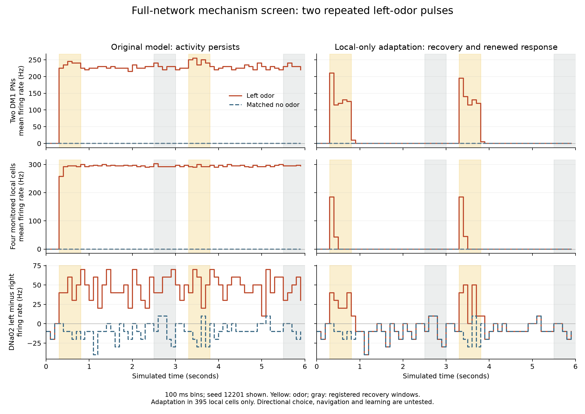

# Full-network local-only adaptation: recovery screen passed

2026-10-07. The local-only candidate responds to an odor pulse, returns to the matched no-odor baseline, and responds again to a repeated pulse on both fresh diagnostic seeds. The original model retains elevated activity. This is a successful **one-sided recovery mechanism screen**, not full controller qualification, biological validation or evidence of learning.

## Frozen comparison

Eight six-second full-network trials compare original and local-only adaptation, each with no odor and left odor, on seeds **12201 and 12202**. Both odor pulses use the existing 50 Hz encoding during [0.3, 0.8) and [3.3, 3.8) seconds; walking support remains 65 Hz. All **138,639 neurons and 15,091,983 aggregated connections** remain present with unchanged signs and weights. Learning is frozen.

Adaptation is restricted to **395 annotated ALLNs**, excluding the 34 known nonspiking lLN2P_a/b/c cells. PNs and ORNs are not adapted. Each selected local spike adds 13.5 mV to a voltage-equivalent adaptation term with 450 ms decay. The fixed setting was taken from the strongest earlier registered grid point, not optimized on these seeds. Exact-root spiking identities and kinetics for the remaining local population are unqualified engineering assumptions. No inhibitory adapter, lesion, sign correction, sensory gain or motor-decoder change accompanies it.

The protocol was written and source-hashed before launch. It declares only no-odor/left-odor testing and explicitly disallows promotion or full qualification from this screen. Original response, recovery, burst, support and determinism bounds are retained. Bilateral Gate 3 and gradient representation cannot be evaluated from this design.

## Observed outcomes

Each range covers both seeds and both pulses. Recovery windows remain **[100, 120) and [220, 240)** at 25 ms per window: [2.5, 3.0) and [5.5, 6.0) seconds. Differences use each model's matched no-odor trial.

| Measure | Original | Local-only candidate | Existing bound |
|---|---:|---:|---:|
| Pulse response gain, mean of two DM1 PNs | 15–240 Hz | 140 Hz in all four checks | At least 10 Hz |
| Individual DM1 PN recovery difference | 220–240 Hz | 0 Hz | Absolute difference at most 5 Hz |
| Four monitored individual local recovery differences | 282–304 Hz | 0 Hz | Absolute difference at most 5 Hz |
| Signed DNa02 difference during recovery | 50–66 Hz | 0 Hz | Absolute difference at most 5 Hz |
| Largest 100 ms mean PN excess in registered post-pulse intervals | 240–245 Hz | 0 Hz | At most 20 Hz |
| Walking-support retention | Pass, 2/2 seeds | Pass, 2/2 seeds | At least 80% of original support-only rate |

The first response gain is relative to the matched no-odor pulse interval. The repeated response gain is relative to the first registered recovery interval, exactly as in the frozen evaluator. Individual recovery checks avoid cancellation between cells. The DNa02 measure is the signed left-minus-right difference; it does not test directional response during a pulse.

## Independent checks and scope

- All **1,920 chunks** pass hash and spike-count checks. A separate offline calculation reconstructs every reported gate metric directly from raw individual spikes and matches the evaluator exactly.
- Original/candidate external spike indices and times match exactly for each seed/cue/window.
- All eight initial/final effective-weight hashes equal `f6f6ab9f7c49e14a906d120c705e6af7814ecdeeecaaefad8b1280bdb71e7732`; learning updates remain zero.
- Four checkpoints, one per stimulated model/seed, continue in fresh processes for five windows with exact spikes, counts, inputs and motor commands. Whole voltage, conductance and adaptation errors are **zero**. Adaptation outside the 395-cell mask is zero in those whole-state checks.
- This does not simply silence the full network. Candidate stimulated trials emit **40,336–40,785 spikes per odor pulse**, retain support activity, and end with the same final half-second whole-network count as matched no odor (165 or 240 spikes by seed).

These are matched simulations of one cue direction on two diagnostic seeds, not independent behavioral subjects or a held-out learning study. No right cue, symmetric cue, unequal gradient, body movement, odor B, long-run robustness or learning is tested. Four monitored locals are examples, not a claim that all 395 cells have individually passed a recovery criterion. A visually clear plot cannot widen this scope.

## Runtime and preservation

One worker completed the package, including continuation and evaluation, in **411.95 seconds (6 minutes 52 seconds)**. Largest worker peak RSS was **2.605 GiB**. Session swap use fell from 3,072,196,608 to 2,954,756,096 bytes; approximately 38.7 MB of additional swap-out was measured between scheduling samples. This is measured telemetry, not a promise of no swap traffic. The 2 GiB disk reserve remained enforced. Raw spikes, checkpoints and failed original trials remain local and immutable.

The live application/controller remains unchanged. The next decision is recorded in ../LOCAL_RECOVERY_DECISION.md: freeze this candidate and test the unchanged bilateral/gradient criteria prospectively, before any embodied or learning work.
