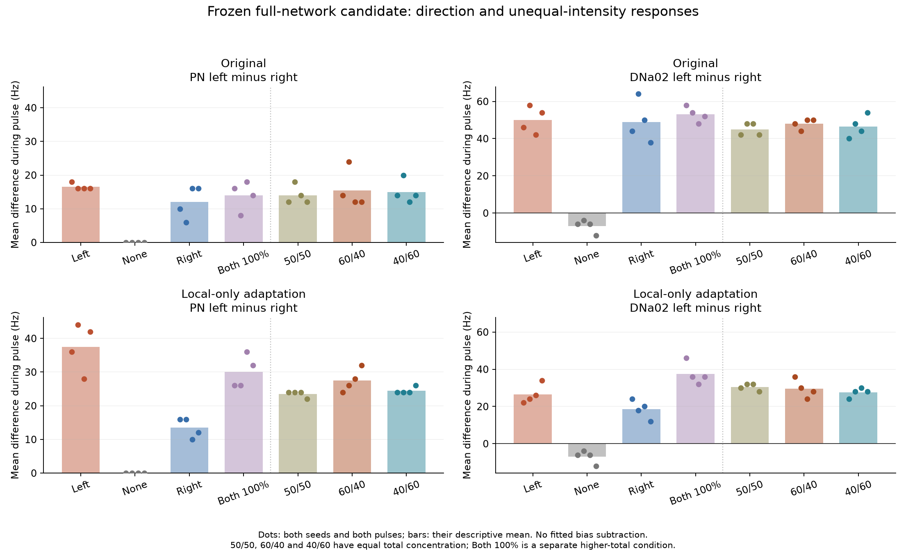
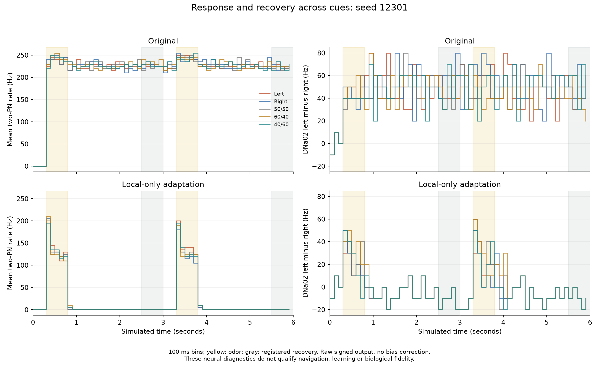

# Recovery generalizes; direction and gradient criteria fail

2026-10-07. All **28 full-network validation trials** completed on fresh seeds 12301 and 12302. Local-only adaptation passes every tested response/recovery, late-burst, support and continuation check across the six stimulated conditions. It fails every original PN directional and gradient comparison, and every additional unilateral DNa02 alignment comparison. The candidate is not promoted; the live controller remains unchanged.

## What was frozen

Source and protocol were committed and published as `bc0cebc` before execution. Original and candidate each receive seven independent six-second trials per seed: none, left, right, full bilateral, equal 50/50, 60/40 and 40/60. Each stimulus repeats at [0.3,0.8) and [3.3,3.8) seconds. The unequal cases and their 50/50 reference have equal total concentration; full bilateral has higher total concentration. The existing synthetic 50 Hz maximum ORN encoding and 65 Hz walking support remain fixed.

The candidate applies the previously frozen 450 ms/13.5 mV adaptation only to 395 nonpatchy ALLNs; PNs and ORNs are unchanged. All 138,639 neurons, 15,091,983 aggregated connections, original signs, effective weights and motor-decoder coefficients remain present. Learning is disabled. Exact-cell physiological fits remain unavailable; this is an engineering neural screen.

## Gate outcomes

Counts are seed/pulse/cue comparisons, not independent animals. Each stimulated cue has two pulses on two seeds, giving 24 response/recovery and 24 post-pulse burst checks per model. Direction and gradient each have four matched seed/pulse comparisons. A complete primary pass requires every applicable comparison; unchanged recovery windows are [100,120) and [220,240).

| Acceptance group | Original | Local-only candidate |
|---|---:|---:|
| Response gain only | 23/24 | **24/24** |
| Individual PN recovery | 0/24 | **24/24** |
| Four monitored local-cell recovery | 0/24 | **24/24** |
| Signed DNa02 recovery | 0/24 | **24/24** |
| Combined response and individual recovery | 0/24 | **24/24** |
| Post-pulse 100 ms PN burst bound | 0/24 | **24/24** |
| Walking-support retention | 2/2 | **2/2** |
| Original Gate 3: PN directional opposition | 0/4 | **0/4** |
| Original Gate 6: PN unequal-gradient representation | 0/4 | **0/4** |
| Additional DNa02 unilateral alignment | 0/4 | **0/4** |
| Additional DNa02 gradient alignment | 2/4 | **1/4** |

Candidate PN response gain is **130–185 Hz** across all stimulated comparisons. Individual PN and four monitored local recovery differences are all zero; signed DNa02 recovery differences are zero. The maximum candidate 100 ms PN excess in either registered post-pulse interval is zero. Original recovery differences reach 238 Hz for PNs, 304 Hz for monitored locals and 76 Hz for the signed DNa02 signal; its post-pulse burst maximum is 250 Hz.

## Why direction fails

The candidate's PN left-minus-right signal differs reliably in magnitude between binary cues: left-minus-right trial separation is 18–30 Hz, above the 10 Hz minimum in all four comparisons. **Both unilateral cues remain on the positive side of no odor**, however, so the unchanged opposition criterion fails. Separation alone cannot turn this into a pass.

| Seed | Pulse | Left cue PN contrast | Right cue PN contrast | No odor |
|---|---:|---:|---:|---:|
| 12301 | 1 | 36 Hz | 16 Hz | 0 Hz |
| 12301 | 2 | 44 Hz | 16 Hz | 0 Hz |
| 12302 | 1 | 28 Hz | 10 Hz | 0 Hz |
| 12302 | 2 | 42 Hz | 12 Hz | 0 Hz |

The DNa02 steering signal also rises above its matched no-odor value for both sides. Unilateral DNa02 separations range from -2 to 22 Hz, with no comparison bracketing no odor as required. Motor commands reproduce the fixed neural decoder exactly; no physical turning or successful navigation is demonstrated by these measurements.

## Why gradient representation fails

| Seed | Pulse | 60/40 PN contrast | 50/50 PN contrast | 40/60 PN contrast | Unequal separation |
|---|---:|---:|---:|---:|---:|
| 12301 | 1 | 24 Hz | 24 Hz | 24 Hz | 0 Hz |
| 12301 | 2 | 26 Hz | 24 Hz | 24 Hz | 2 Hz |
| 12302 | 1 | 28 Hz | 24 Hz | 24 Hz | 4 Hz |
| 12302 | 2 | 32 Hz | 22 Hz | 26 Hz | 6 Hz |

The first three separations are below 5 Hz and fail equal-input bracketing. The last meets the separation minimum, but 40/60 remains above 50/50, so it also fails. One DNa02 gradient comparison passes; the other three fail. These inconsistent outputs cannot replace the failed primary PN criterion or establish a robust gradient code.

The figures use raw recorded neural rates without fitted bias subtraction or normalization. The timeline shows seed 12301 in 100 ms bins; the comparison dots include both seeds and pulses. Recovery success does not imply that every individual modeled cell is silent: the gates inspect the specified PNs, four locals and signed descending difference, while support remains active.

## Independent audit and interruption

- All **6,720 chunks** pass hash and individual spike-count checks. Raw-spike rate reconstruction reproduces all gate metrics exactly.
- The original frozen evaluator, executed with a separate output-root globals dictionary, agrees exactly on every primary recovery, contrast, burst, support and gradient metric. Its module and historical output are unmodified.
- External events match exactly between original and candidate for every seed/cue/window. Requested rates and the shared 0.1 ms clock are checked.
- All motor commands reconstruct exactly from raw descending rates and the unchanged smoothing equation.
- Every initial/final effective-weight hash equals `f6f6ab9f7c49e14a906d120c705e6af7814ecdeeecaaefad8b1280bdb71e7732`; learning updates remain zero.
- Four fresh-process checkpoint continuations reproduce five windows exactly, with whole voltage/conductance/adaptation errors of zero. Adaptation outside the 395-cell mask is zero in those candidate whole-state checks.
- The owned candidate/right-cue worker on seed 12301 was deliberately terminated after **60 complete chunks**. Reconstruction from the same seed matched every existing recording field, retained the exact hashed prefix and appended the remaining 180 chunks. No completed recording was deleted or overwritten.

## Runtime, preservation and limits

The one-worker batch, including controlled interruption/reconstruction, checkpoint continuations and primary evaluation, took **1,415.45 seconds (23 minutes 35 seconds)**. Largest worker peak RSS was **2.518 GiB**. Swap use grew from 2.06 to 3.02 GiB between scheduling samples, with about 173 MiB additional swap-out; these are session measurements, not full-application memory figures. The local package uses approximately **1.11 GiB**, mostly checkpoints; the 2 GiB free-space reserve remains enforced. No raw archive is automatically deleted.

Two fresh seeds establish this bounded repeatability result, not population confidence, long-term robustness or biological fidelity. Other neural populations or temporal patterns may still carry useful side information; this test does not demonstrate that the entire network lacks it. Odor B, realistic sensory response fits, body behavior, navigation and learning remain untested here.

The numerical audit found no implementation/evaluator defect explaining these gate failures in this package. Uniform effective PN input gain and an unestablished action readout remain plausible model-level causes, not proven causes of every downstream failure. The next decision is ../DIRECTION_DECISION.md. No acceptance threshold or historical failed result was changed.
