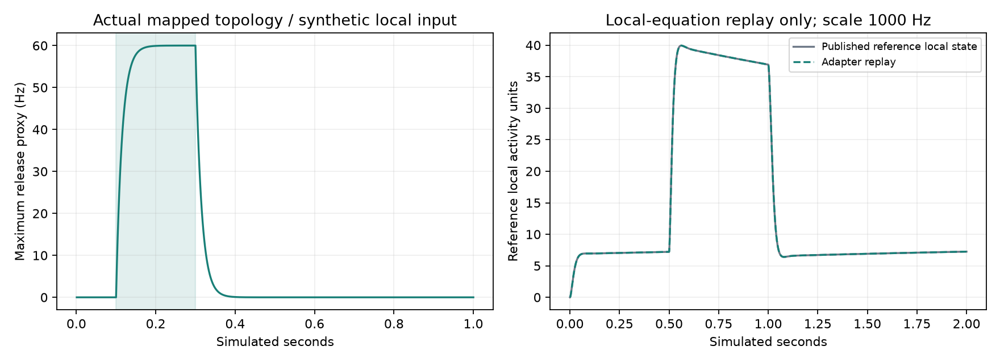

# Qualified local-inhibition adapter: isolated acceptance

Implemented an engineered, inactive adapter and an exact anatomical routing proposal for the 12 lLN2P_b roots with the qualified GABA/MIP annotation bridge. It does not change the live application, the original FullBrain class, learning, recordings or checkpoints. This result does not establish repaired odor dynamics or behavior.

## Routing

All **64,430 anatomical sites across 15,107 original modeled pairs** touching these roots are preserved exactly. There are 19,890 routing groups after allocation. 212 root-and-region local nodes have both eligible input and output sites. 18,841 input sites and 14,276 output sites receive candidate local assignments; 17 sites connect local nodes to each other. 31,330 sites retain both original spiking endpoints. The input and output counts overlap at local-to-local sites and must not be added as independent synapse totals.

Only previously eligible native-left regions and fresh individually eligible right DM1/DP1m assignments are used. Unassigned sites stay in original spiking routing, retaining original signs. Exact roots and model indices are retained. No connection was deleted, duplicated, invented or filled from nearest-region guesses.

This is a partial hybrid-neuron proposal, not a validated cable model: local nodes and the remaining spiking neuron coexist. An eventual full-network integrator must subtract only the routed site contribution from original edges, conserve all original pair counts, and prevent double counting. The route compilation alone does not apply those changes.

## Equation and units

`tau * dx/dt = -x + clip(drive + C*x, 0, 1)`.

`x` is dimensionless. External `drive` is signed count-weighted input rate divided by incoming local site count and 100 Hz. Incoming spiking signs remain those of the frozen graph. `C` contains only negative, count-normalized connections from anatomically assigned local nodes. Local-to-local connections are excluded from external drive to avoid double counting.

`release_proxy_hz = 100 * x`. Non-local target output is `-0.275 mV/site/spike * site_count * release_proxy_hz`, an average drive proxy in mV/s. This output helper never writes into Brian2. It is not receptor conductance or measured transmitter release. The full-network bridge must still establish how this average drive enters the existing voltage-equivalent g state at the 100-microsecond clock and 1.8-ms delay.

The 15-ms activity time constant is borrowed as an explicit numerical hypothesis from the LN2P_c/DC3 reference, not fitted DM1/lLN2P_b physiology. The 100-Hz normalization and activity cap are engineered. Coupling between mapped nodes arises only from actual routed synapses; skeleton geometry does not establish electrical isolation. Electrical propagation, MIP and receptor-specific kinetics are excluded. These limits are frozen in `protocol.json`.

## Acceptance results

Six tests pass. All nine isolated checks pass. With fourth-order integration, analytic maximum release errors at time steps 200, 100 and 50 microseconds are 6.37e-9, 3.96e-10 and 2.47e-11 Hz, respectively. The 100-microsecond error passes the original 1e-5-Hz gate. Pulse-off release at 150 ms is 0.002951 Hz, below the original 0.01-Hz gate.

The unchanged reference local-state equation replay has maximum relative error 0.1022%. This test uses a 1000-Hz normalization to avoid clipping the published state. It tests local-equation compatibility, not the default 100-Hz normalization, upstream feedback or biological parameter transfer.

The actual 212-node coupling topology was driven by a synthetic 200-ms step on six right-DM1 local nodes. States stayed finite and bounded; maximum release at 150 ms after offset was 0.002724 Hz. These inputs bypass sensory neurons and are not an odor-conditioning trial.

JSON checkpoint continuation is exactly equal, with maximum error zero. Activity observation does not alter state. Configuration hashes prevent restoring a checkpoint with altered parameters. The routing audit verifies every original pair count. Final isolated validation took 2.49 seconds, excluding build/tests.

The initial second-order integration attempt failed the stricter accuracy gate while passing other checks. `initial-heun-attempt/` preserves its code, protocols and results. Integration was improved without changing time constants, normalization, anatomical routing or acceptance thresholds. `numerical-amendment.json` records the correction and removal of expensive observer bookkeeping. No failed attempt was relabeled as passed.

## Next gate

Implement and validate an isolated Brian2 clock/delay bridge, including original-edge residual weights, unit conversion, event timing, checkpoint/reset behavior and observer parity. Then freeze a full-network candidate and compare it against the unchanged baseline using the existing response, recovery and contrast criteria. Calibration seeds must remain separate from acceptance seeds. Do not promote the adapter on these isolated checks alone.

Scientific support and source limitations are documented in the frozen `../graded-compartment-reference-v1/EVIDENCE.md` and `../glomerular-affine-registration-v1/local-inhibition-contract.json`. This implementation intentionally distinguishes source evidence, qualified annotations and engineered assumptions.
