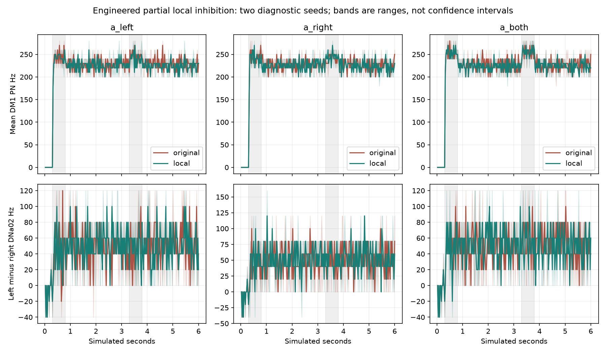

# Local-inhibition clock bridge: full-network diagnostic

All 17 six-second trials and the fresh-process continuation checks completed. Response/recovery gates: **{'original': False, 'local': False}**. Sensory contrast gates: **{'original': False, 'local': False}**. No controller promotion, body validation or learning claim.

The experiment retains all 138,639 modeled neurons and 15,091,983 original connection records. A count-preserving allocation of 64,430 sites touching the 12 qualified lLN2P_b roots replaces only eligible portions with local activity routes; unresolved portions retain original signed spiking weights. Sites are not duplicated into both mechanisms. Other cells and connections, input profile and decoder remain frozen.

The 212 local nodes use normalized bounded activity with a hypothesized 15-ms time constant. Incoming delayed spikes are converted by an engineered 5-ms exponential rate filter. All local paths and outputs have a 1.8-ms delay on the 100-microsecond brain clock. Outputs add negative increments to the original voltage-equivalent g state, not receptor conductance. Local-to-local inhibition uses the delayed local state and actual routed synapses. The partial hybrid residual, missing electrical propagation, receptor kinetics and MIP are explicit limitations. No physiological fit is claimed.

Two diagnostic seeds use the unchanged pulse schedule, response/recovery windows and contrast gates. Both pulse response gains must reach 10 Hz. Each DM1 PN, selected local neuron and signed DNa02 must recover within 5 Hz of same-model support-only trials. Contrast requires opposite left/right deviations from support-only and left-minus-right contrast at least 10 Hz. These are diagnostic gates, not population-level statistical or navigation evidence.

| Model | Cue | Seed | Pulse | Response gain Hz | Max PN recovery difference Hz | Response/recovery gate |
|---|---|---:|---:|---:|---:|---|
| original | a_left | 11801 | 1 | 240.00 | 236.00 | fail |
| original | a_left | 11801 | 2 | 17.00 | 232.00 | fail |
| original | a_right | 11801 | 1 | 243.00 | 234.00 | fail |
| original | a_right | 11801 | 2 | 11.00 | 232.00 | fail |
| original | a_both | 11801 | 1 | 250.00 | 230.00 | fail |
| original | a_both | 11801 | 2 | 26.00 | 236.00 | fail |
| original | a_left | 11802 | 1 | 243.00 | 234.00 | fail |
| original | a_left | 11802 | 2 | 21.00 | 232.00 | fail |
| original | a_right | 11802 | 1 | 237.00 | 234.00 | fail |
| original | a_right | 11802 | 2 | 12.00 | 234.00 | fail |
| original | a_both | 11802 | 1 | 254.00 | 230.00 | fail |
| original | a_both | 11802 | 2 | 29.00 | 232.00 | fail |
| local | a_left | 11801 | 1 | 241.00 | 234.00 | fail |
| local | a_left | 11801 | 2 | 12.00 | 230.00 | fail |
| local | a_right | 11801 | 1 | 237.00 | 230.00 | fail |
| local | a_right | 11801 | 2 | 17.00 | 236.00 | fail |
| local | a_both | 11801 | 1 | 253.00 | 224.00 | fail |
| local | a_both | 11801 | 2 | 32.00 | 230.00 | fail |
| local | a_left | 11802 | 1 | 237.00 | 232.00 | fail |
| local | a_left | 11802 | 2 | 14.00 | 232.00 | fail |
| local | a_right | 11802 | 1 | 239.00 | 236.00 | fail |
| local | a_right | 11802 | 2 | 18.00 | 226.00 | fail |
| local | a_both | 11802 | 1 | 250.00 | 232.00 | fail |
| local | a_both | 11802 | 2 | 35.00 | 228.00 | fail |

Raw chunk hashes, spike/count parity and paired external event equality were checked. Observer-disabled local trials match exactly. Baseline and local checkpoints resume five windows in fresh processes with exact recorded arrays and full voltage/g state error at most 1e-10 mV. Bridge tests separately exercise delayed arrival, units, pending-queue continuation and residual-count allocation.

Trial wall time: 934.1 seconds. Peak worker RSS: 2.63 GiB. One native brain worker. Original source and previous checkpoints were preserved. Scientific failure remains failure even if all engineering checks pass.

Independent post-run audit passed all 4,080 chunks: owned input RNG, integer input-clock ticks, spike/count parity, decoder reconstruction, and initial/final weight hashes against the source graph and count-preserving residual allocation. See `independent-audit.json`, `bridge-engagement.json` and `DECISION.md`. The comparison figure was visually inspected.
