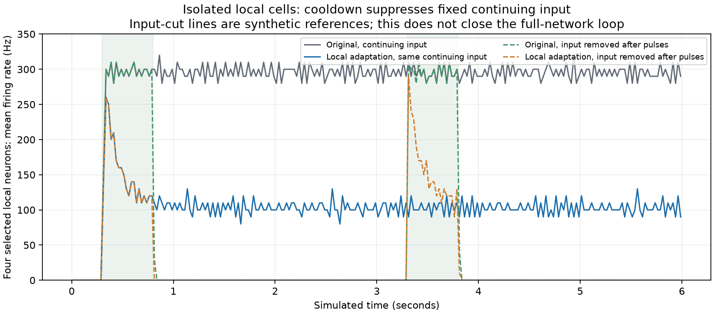

# Local adaptation under fixed recorded drive

2026-10-07. Eighteen isolated six-unit runs distinguish continuing input from input-off recovery. No full-network simulation or production controller change occurs in this package.

Six target units (two DM1 PNs and four previously selected local cells) receive saved pre-gate incoming events from original full-network recordings. Arrival signs and 1.8 ms delays remain fixed; native Brian2 threshold, reset and refractory gates are recomputed. Eight originals cover no odor, left, right and bilateral odor on seeds 12001 and 12002. Their matched candidate adapts the **four local units only**, using fixed 450 ms decay and 13.5 mV spike increment from the strongest already registered setting. These are engineering stress parameters, not measured local-cell physiology.

All eight original replays reproduce spikes and 25 ms counts exactly, with conductance/adaptation errors below 1e-10 mV. The two PN spike trains are also exactly unchanged in the local-only condition: because incoming drive is fixed, altered local output cannot alter the PN input in this experiment.

| Recovery measure | Original | Local-only adaptation |
|---|---:|---:|
| Four individual local rates under continuing recorded input | 284–302 Hz | 90–120 Hz |
| Stimulated recovery comparisons within the existing 5 Hz bound | 0/12 | 0/12 |
| Synthetic input-off local recovery | 0 Hz | 0 Hz |

The two synthetic references retain the original left-odor incoming trains only during [0.3, 0.8018) and [3.3, 3.8018) seconds, zeroing other arrivals. They are input-cut references, not full-network lesions or natural odor trials. Their recovery is quiet with or without adaptation.

The fixed-drive test demonstrates that adaptation lowers firing but cannot extinguish these local units under unchanged sustained presynaptic bombardment. **It does not predict failure in a closed recurrent network:** changing local output there can reduce subsequent incoming drive. This difference justifies a separate full-network comparison rather than another parameter grid.

The package took **10.56 seconds**, with **0.294 GiB** peak process RSS. The protocol pins sources and selection before execution; raw NPZ outputs, exact-reconstruction checks and synthetic-reference hashes are retained locally. No weights, signs, encoding, decoder, historical acceptance thresholds or live controller changed.
