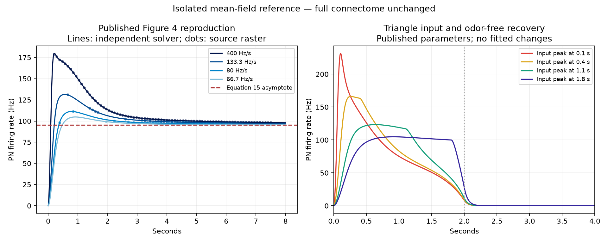

# Published olfactory dynamics: steps 1–2 completed

## Selection

Selected [Liu et al. (2021)](https://www.frontiersin.org/journals/computational-neuroscience/articles/10.3389/fncom.2021.730431/full) as an isolated temporal-response reference. Its model includes release facilitation, resource depletion/recovery and presynaptic inhibition. These are transient synaptic dynamics, distinct from the garden’s long-term learning rule. The full connectome and application remain unchanged.

The [2024 PQN alternative](https://github.com/tnanami/fly-olfactory-network-fpga) is pinned at c064f47da7a1f8c4e9137c09b5e327d1a38ab9f4 with a clean MIT-licensed source checkout. Its documented experimental workflow requires FPGA hardware/Vivado; we have not reproduced that hardware workflow.

## Reproduced reference behavior

Implemented published equations 1–5 and the Figure 4/5 parameter set independently. Official XML/HTML and source figures are cached with hashes. No author numerical simulator or raw modeled Figure 4/5 traces were linked in the article. Therefore the reproduction claim is equation-level checks and selected published-raster agreement, not author-code parity, full-paper replication or new biological validation.

The paper provides conductance-strength values and k=5 Hz/nS. Applying that conversion to both PN/LN strength coefficients is an explicit implementation convention: it reproduces the plotted peak and plateau. The equation notation does not spell this conversion out; that ambiguity remains documented. No new fitted parameters were introduced.

| Published ramp slope (Hz/s) | Valid source-image samples | Mean absolute error (Hz) | Maximum error (Hz) |
|---:|---:|---:|---:|
| 400 | 80 | 0.152 | 0.761 |
| 133.3 | 45 | 0.365 | 0.808 |
| 80 | 49 | 0.836 | 2.312 |
| 66.7 | 34 | 0.579 | 1.369 |

All four meet the registered 3 Hz mean / 6 Hz maximum error limits and 30-point minimum. Raster errors include axis, line-width, JPEG and color uncertainty. The first extractor falsely averaged distinct colored components in some columns and failed one curve. Its result and script are preserved. The amended source-only rule rejects ambiguous multi-component columns for every curve; it uses no model prediction to choose pixels and changes no model parameter or acceptance threshold. See PROTOCOL-original.md, PROTOCOL.md and both comparison receipts.

Independent checks:

- DOP853 and separately written RK4 agree; largest PN/LN difference across the four 8-second ramps is 2.29e-09 Hz. Halving RK4 time step also passes.
- Fifteen steady-state conditions agree with published Equation 12; largest absolute state discrepancy is 1.36e-12.
- Four 100-second ramps approach Equation 15’s 95.283 Hz asymptote within 0.204 Hz.
- Triangle responses using the Figure 5 parameter set show onset-sensitive peaks, decline and return after input removal. Their Figure 5A waveform shapes were visually compared; Figure 5B/C experimental fits are not claimed reproduced.
- Engineered step and repeated-pulse reference checks verify adaptation during maintained input, finite bounded release/resource states and recovery after removal. These are equation checks, not learned preference.
- Saving all five reference state variables and continuing agrees with uninterrupted integration within 6.3e-09 absolute state units. This is a reference ODE continuation check, not a full-brain checkpoint proof.

## What can carry over—and what cannot

The reference establishes a source-backed transient synaptic-state mechanism and a numerical benchmark for future implementation. It does not supply DM1/DM2-specific release parameters, exact cell/compartment maps, descending control, or a treatment of the full brain’s recurrent loops. Values fitted for generic Figure 4 conditions or other glomeruli cannot be relabeled as validated DM1/DM2 physiology.

The recorded full network continues firing downstream after stimulated DM1 ORNs already stop. An ORN-to-PN adaptation mechanism alone therefore cannot be assumed to extinguish that state. This isolated feedforward model returning to baseline is not proof that grafting it onto the full graph will fix persistence.

## Next gate

Before a full-network candidate: map exact annotated afferent and local-inhibitory populations; distinguish presynaptic bouton inhibition from negative postsynaptic weight; audit which recurrent inputs sustain PN activity; establish a published mechanism/parameter basis for those cells and paths. If a spiking approximation is needed, validate its timing, release/resource states and recovery against this reference first. Keep all full-network neurons/edges, preserve base connection signs, assign a new model identity and include all extra transient state in checkpoints. Retain the original full-brain baseline and the existing directional/recovery gates. Do not add a privileged navigator or label this reference as the fly’s new brain.

Reference selection and selected-result reproduction are complete. Full-network integration, directional navigation, behavioral learning and application acceptance remain pending.

## Runtime

Reference calculations took 17.1 seconds on the local Python runtime, excluding source retrieval, digitization and plotting. See provenance.json for dependency/source identities. Raw numerical arrays and source-image samples are retained.
