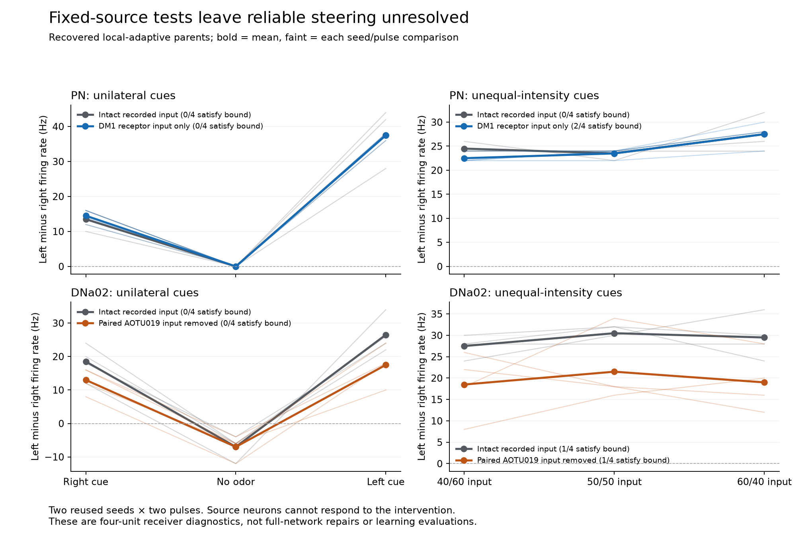

# Recorded-input receiver comparison

The saved four-neuron dynamics reconstruct exactly, but neither tested input change is a sufficient steering repair. Removing local/recurrent PN input leaves both unilateral cues with positive left-minus-right PN activity. Removing the paired AOTU019 input releases right DNa02 firing, yet both cues still lie on the same side of the no-odor reference. No graph, live controller, learned weight, or acceptance definition changed.

## Plain-language interpretation

The input already tells left odor from right odor. The two smell-output neurons respond more strongly on the left for either cue, even when they receive only direct receptor signals. Simply stripping away the rest of their input does not make their difference a reliable left/right command.

The identified inhibitory pathway does suppress the right steering neuron. Removing its recorded delivery makes that neuron fire substantially more. However, the left steering neuron also changes, and the resulting pair still does not reliably choose opposite directions. The inhibition explains part of the absolute firing suppression; it does not, by itself, explain away the failed steering behavior.

This is a small diagnostic using signals saved from the full brain. Source neurons keep their original spike trains instead of responding to the intervention. It therefore tests a conditional explanation, not whether deleting connections repairs a living recurrent simulation.

## Fixed protocol and numerical checks

Registration/source commit: `b6734af`, published before execution. Protocol SHA-256: `45f3b439edea26c082d1437ed27a540c593dbd1091b2884cefc21a2e152d8a58`.

- All 28 original/local-adaptive parent recordings, two previously used seeds, seven cues, two pulses per recording; each parent is six simulated seconds.
- Four unchanged point-neuron receivers: exact left/right DM1 lPN and DNa02 roots, outside the 395-cell local-adaptation mask. No direct external stimulation reaches these recipients.
- Native Brian2 integrates at 100 microseconds, with 1.8 ms synaptic delay, 2.2 ms refractory duration, the original reset and signed weight scale. Inputs are reconstructed before recipient refractory gating. Threshold crossings, resets and gates are predicted anew.
- All 28 intact replays passed before any altered-input replay ran: spike ticks and 25 ms counts match exactly; maximum sampled voltage error 5.69e-14 mV, g error 1.14e-13 mV, adaptation error zero, against the frozen 1e-10 mV bound.
- The 56 altered-input replays preserve untouched receiver spikes/counts exactly and have zero sampled-state control error. Intact PN and DNa02 direction/gradient metrics equal the original evaluator's results exactly.
- An independent audit rehashed all 6,720 raw chunks, 28 input arrays and 84 replay outputs. Direct dense graph/event accumulation matches all 336 receiver input arrays exactly. A separate closed-form integrator, without Brian2 or the analyzer's replay/partition helpers, predicts every threshold spike and count in all 336 recipient units. Its maximum voltage/g errors are 2.85e-13/1.14e-13 mV. All 96 direction/gradient and 144 recovery calculations agree independently.
- Fifteen focused partition, signed-event, recorded-drive and directional-metric tests passed. The figure was inspected visually.

These checks support recording and numerical reconstruction for the selected recipients. They do not establish that the point-neuron assumptions, neurotransmitter scaling, anatomical gain, upstream sensory encoding or complete brain model are biologically correct.

## Conditions and exact identities

| Receiver | Root ID | Imported index |
|---|---|---:|
| DM1 lPN left | 720575940630770042 | 100454 |
| DM1 lPN right | 720575940619071005 | 37714 |
| DNa02 left | 720575940629327659 | 92992 |
| DNa02 right | 720575940604737708 | 904 |

`intact` retains all incoming signed delivery. `pn_dm1_only` retains only the exact 68 DM1 receptor sources on the two PN rows while preserving both DNa02 inputs. `dna_without_aotu019` retains both PN inputs and removes only the following DNa02 records. The AOTU sources are annotated GABA; their imported signs are already negative. This is an input-removal hypothesis, not a sign correction.

| Presynaptic AOTU019 root | Postsynaptic DNa02 root | Represented sites | Signed count |
|---|---|---:|---:|
| 720575940631517251 (right) | 720575940629327659 (left) | 121 | -121 |
| 720575940633556644 (left) | 720575940604737708 (right) | 216 | -216 |
| 720575940633556644 (left) | 720575940629327659 (left) | 1 | -1 |

Three aggregated connection records represent 338 anatomical sites. The full graph and source spike trains stay unchanged. Baseline and candidate source activity are both included; no recipient adaptation is added.

## Descriptive criteria

Direction requires left-cue minus right-cue contrast >=10 Hz and both cues on opposite sides of matched no-odor activity. Unequal intensity requires 60/40 minus 40/60 contrast >=5 Hz and both on opposite sides of 50/50. These preserve the existing PN Gate 3/6 definitions and separately named descending criteria. Merely obtaining a large difference between cues is insufficient.

Counts below are four seed/pulse comparisons from **two reused seeds**, not four independent flies. Meeting a criterion in an isolated replay is not controller qualification.

| Parent source activity | Tested readout/input | Direction | Unequal intensity |
|---|---|---:|---:|
| Original | PN intact | 0/4 | 0/4 |
| Original | PN receptor-only | 0/4 | 0/4 |
| Original | DNa02 intact | 0/4 | 2/4 |
| Original | DNa02 paired AOTU input removed | 0/4 | 0/4 |
| Local-adaptive | PN intact | 0/4 | 0/4 |
| Local-adaptive | PN receptor-only | 0/4 | 2/4 |
| Local-adaptive | DNa02 intact | 0/4 | 1/4 |
| Local-adaptive | DNa02 paired AOTU input removed | 0/4 | 1/4 |

In the recovered archive, PN receptor-only binary contrasts are 36–38 Hz for left cues and 12–16 Hz for right cues, relative to a zero no-odor PN contrast. All remain positive. Gradient comparisons satisfy the bound only on seed 12301, on both repeated pulses; seed 12302 fails both. This is partial representation under restricted drive, not reliable gradient decoding.

Mean recovered DNa02 pulse firing rates, averaged across the same four summaries:

| Cue | Intact left / right (Hz) | Paired AOTU removal left / right (Hz) |
|---|---|---|
| Left odor | 27.5 / 1.0 | 35.0 / 17.5 |
| Right odor | 20.5 / 2.0 | 33.0 / 20.0 |
| Both, full strength | 37.5 / 0.0 | 50.0 / 25.0 |
| Equal 50/50 | 31.5 / 1.0 | 43.5 / 22.0 |
| 60/40 | 29.5 / 0.0 | 36.5 / 17.5 |
| 40/60 | 28.5 / 1.0 | 37.0 / 18.5 |
| No odor | 3.0 / 10.0 | 3.0 / 10.0 |

All four altered binary DNa02 contrasts remain above their matched no-odor value. The gradient criterion still satisfies only 1/4 comparisons; the second seed's separation is negative on both pulses. The original operating-state gradient result worsens from 2/4 to 0/4 under removal. There is no consistent directional benefit supporting adoption of this lesion.

For all recovered conditions, the limited receiver recovery bounds remain satisfied in 24/24 cue/pulse comparisons per arm. In original source activity, PN receptor-only recovery improves from 0/24 to 24/24, while DNa02 recovery remains 0/24. The diagnostic records only these four receiver recovery quantities; it cannot newly validate local-cell recovery, bursts, walking support, whole-state continuation, body behavior or learning. The previously completed intact-network checks retain their original status.

## Measurements and availability

Native preparation plus 84 replays: **62.19 seconds**, peak process RSS **0.900 GiB**. Independent audit: **10.67 seconds**, peak RSS **0.808 GiB**. Neither creates a new full-brain simulation. New compressed inputs occupy 12,055,651 bytes and replay outputs 1,174,010 bytes, approximately 12.62 MiB combined. The 2 GiB free-space reserve was preserved, with roughly 198 GiB free at the delivery check.

Public source, protocol, result summary, native-validation receipt, independent audit, plots and decision are published with the existing evidence snapshot. Raw prior trials/checkpoints and the new `inputs/*.npz` and `replays/*.npz` remain local and undeleted. Summary hashes are not a substitute for those arrays.

## Decision

Do not adopt a recurrent-input deletion, AOTU lesion, fitted offset, gain normalization or new decoder from these results. Preserve all original direction/gradient failures and the useful local-only recovery candidate. The numerical replay mismatch hypothesis is not supported for the selected recipients; incorrect physiological assumptions and upstream/downstream circuit behavior remain open.

The next discriminating check is to preregister the eight-trial direct-MBON32 capability comparison described in [the decision](../RECEIVER_DIAGNOSTIC_DECISION.md). It would test the recovered **intact recurrent network**, on fresh diagnostic seeds, before deciding whether to repair its upstream sensory representation or downstream operating-state/readout assumptions. It has not been launched in this package. Neither a positive nor a negative capability result would alone qualify navigation or learning.
