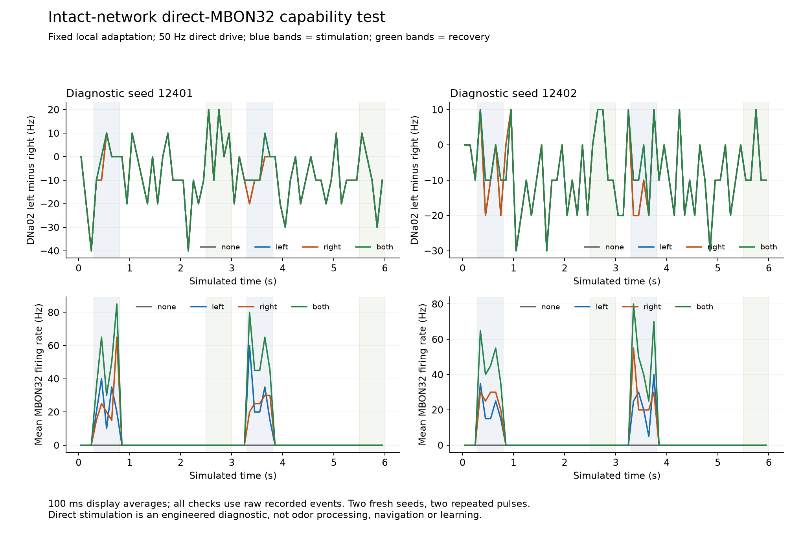

# Recovered intact-network MBON32 capability: completed, direction failed

All eight preregistered full-network trials finished. Direct MBON32 stimulation produces strong, repeatable responses and quiet recovery, but **all four descending steering comparisons fail (0/4 pass)**. Left stimulation shifts pulse-averaged DNa02 contrast by only 2–6 Hz; right stimulation shifts it by 0 Hz in all four comparisons. No controller, graph weight or acceptance definition was changed or promoted.

## Plain-language result

The stimulated neurons are working: they spike during both pulses and stop afterward. Their signals also alter downstream spike timing. The modeled steering pair nevertheless does not produce the required reliable opposite responses. At this setting, the problem extends beyond odor encoding; directly activating this downstream pair is still insufficient for the chosen steering output.

There is an important limit: these odor-free trials never activate any of the 395 local cells carrying the adaptation mechanism. The cooldown is present in the model but receives no spike increments here. This is a failure of the tested route in this operating state, **not proof that adaptation cannot help when the smell circuit is active**. The earlier original-model test uses different seeds and a shorter schedule; it remains historical evidence rather than a matched control.

## Fixed design

The protocol was committed and published as `ec4b977` before the first trial. Protocol SHA-256: `4a5b32536950d0140c8db314884fd75376e285509e63574fe36548c69e2413e1`. All 40 original pinned sources remain unchanged.

- Full available graph: 138,639 neurons, 15,091,983 aggregated records, 54,492,922 represented anatomical synapses. Original signs/scaling retained; no lesions or reduced network.
- Recovered candidate: adaptation only on the same 395 nonpatchy ALLNs, 450 ms decay, 13.5 mV spike increment. Learning disabled; weights remain exactly unchanged.
- Fresh diagnostic seeds 12401/12402, checked against 78 existing protocol files and 126 previously reserved seed values.
- Support-only, left, right and bilateral direct drive; six simulated seconds each. Stimulation at `[0.3,0.8)` and `[3.3,3.8)` seconds; recovery checks at `[2.5,3.0)` and `[5.5,6.0)`.
- Fixed 50 Hz direct input to exact MBON32 roots **720575940609959637 / index 8333 (left)** and **720575940638526278 / index 124996 (right)**. Separate seeded generators use 68.75 mV external jumps. Bilateral DNp09 support is fixed at 65 Hz; odors and vision are zero.
- Both MBON32 roots are additionally **zero refractory in every case, including support-only**, matching the earlier direct-drive convention. Other possible candidate input roots retain their existing zero-refractory policy; other neurons retain 2.2 ms. This explicit input convention differs from the odor-only candidate. It is an engineering diagnostic protocol, not a physiological fit.
- The existing descending decoder remains bounded and smoothed. No body or physical turning is simulated here.

## Measured checks

Counts below use two seeds and two pulses, not four independent flies. Direction preserves the historical ±5 Hz per-side direct-capability bounds and separately requires the existing 10 Hz descending separation with cues bracketing support-only contrast. Bilateral change must stay within 5 Hz. Original PN Gate 3/6 failures remain untouched and are not retested by direct MBON input.

| Check | Passing / measured |
|---|---:|
| Combined descending direction per seed/pulse | **0/4** |
| Stimulated MBON response and renewed response | 12/12 |
| Individual MBON/PN/local and signed-DNa02 recovery | 12/12 |
| Matched-candidate support retention | 24/24 |
| Late MBON and PN burst bounds | 12/12 |
| Fresh-process whole-state continuation | 2/2 |
| Controlled interruption and exact-prefix reconstruction | 1/1 |

Support retention here compares stimulated cases with the **matched candidate support-only** case. It is a newly named perturbation diagnostic, not the earlier candidate-versus-original walking-support qualification. MBON response/burst checks are also explicitly named for this route; they do not replace PN sensory gates.

| Seed | Pulse | Support-only signed DNa02 (Hz) | Left change (Hz) | Right change (Hz) | Bilateral change (Hz) | Left-minus-right separation (Hz) |
|---|---:|---:|---:|---:|---:|---:|
| 12401 | 1 | -2 | +2 | 0 | +2 | 2 |
| 12401 | 2 | -8 | +4 | 0 | +4 | 4 |
| 12402 | 1 | -8 | +4 | 0 | +4 | 4 |
| 12402 | 2 | -12 | +6 | 0 | +6 | 6 |

Only one left-change comparison reaches +5 Hz; no right-change comparison reaches -5 Hz. Bilateral balance satisfies 3/4 comparisons. None reaches the 10 Hz separation/bracketing requirement. Both-stimulation pulse averages match left-stimulation averages for the sampled DNa02 readout, despite verified right MBON activation.

Stimulated MBONs fire at 42–60 Hz over the pulses, versus 0 Hz in their support-only controls. Individual MBON/PN/local and signed-DNa02 recovery differences are zero in all checked windows; maximum late MBON/PN excess is zero. Support input trains and support-neuron counts remain matched. Right stimulation does change exact DNa02 spike times; **zero pulse-averaged contrast change is not a claim of no downstream effect**.

## Recording, restart and independent checks

All 1,920 complete chunks rehash and reproduce full-network spike counts. The independent audit checks half-open 100-microsecond spike timing, direct requested/generator-delivered events, seeded support inputs identical across cases, left/right trains paired with bilateral input, population summaries and exact motor-decoder commands. All 64 response/direction/recovery/support/burst calculations agree.

Both left trials checkpoint at 3.775 simulated seconds. New processes load the complete brain, decoder and both random-generator states and reproduce the next five chunks exactly. Maximum full-network v/g/adaptation differences are **zero**. Checkpoint component hashes verify independently. One owned right worker was terminated after 60 complete chunks; all 60 original chunks were preserved and matched exactly during reconstruction before finishing.

The coordinator initially failed while writing the final summary because one recovery flag was a NumPy boolean. Every trial and checkpoint check had already completed. An output-only amendment was registered/published as `f99bece`: the original evaluator rereads immutable recordings, converts scalar types without changing their values, and saves through the same atomic writer. All original protocol/source hashes stay unchanged; the failure log and partial temporary result remain preserved. Finalization and audit launch **zero** new simulations. See serialization-amendment.json and serialization-repair-receipt.json. The repair fixes serialization, not equations or scientific criteria.

Thirteen prelaunch focused tests and two additional serialization tests pass. The final plot was visually inspected.

## Additional descriptive engagement check

Post-run raw-event accounting finds 91–135 neurons with at least one spike per trial; the full graph remains loaded and updated. Each trial contains 2,697–2,852 spikes. **None of the 395 adapted cells spikes in any of the eight trials**, and both saved full continuation adaptation arrays are exactly zero. This observation is descriptive, was not a preregistered gate, and does not alter the criterion values. See activity-coverage.json and scripts/summarize_capability_engagement.py.

Consequently this package does not compare active adaptation against a matched original model, establish what MBON stimulation does during odor-driven activity, prove a disconnected route, or identify a unique sign/gain/kinetic error. Strong direct-cell responses plus weak signed downstream output establish the bounded failure at the registered drive and operating state.

## Runtime, storage and decision

The eight main trial processes take **49.6–61.1 seconds each**, totaling **413.48 seconds**; their peak RSS is **2.40 GiB**. That sum includes trial initialization and the resumed trial's reconstruction but excludes the extra interrupted prefix process, two fresh-process continuation workers and delivery work. Saved-data evaluation takes 1.70 seconds before audit/rendering. No precise overall wall time was retained after the serialization failure, so the trial-time sum is not presented as total session time.

Raw trial evidence occupies 521,449,023 bytes, including 511,318,310 bytes of checkpoints. Approximately 198 GiB remains free, preserving the 2 GiB reserve. No recording, checkpoint or partial failure artifact was deleted. Public summaries/source/figures exclude raw trial chunks and checkpoints.

Keep the useful olfactory-recovery candidate and every historical failure. Do not fit a decoder or adopt an inhibitory lesion from these two seeds. The next economical step is a **saved-data route and state-engagement audit** comparing these direct-drive runs with existing odor-driven runs; reconstruct selected DNa02 states and separate transmitted signed drive, refractory rejection and threshold response. Any later sensory-context intervention needs a new frozen protocol. The biological route's adequacy and an explicitly engineered readout remain separate choices. See [the decision](../RECOVERED_MBON_CAPABILITY_DECISION.md). No further full-network batch has started.
