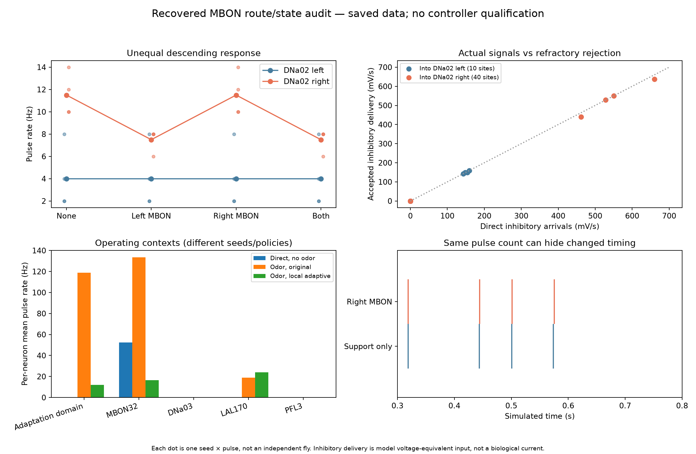
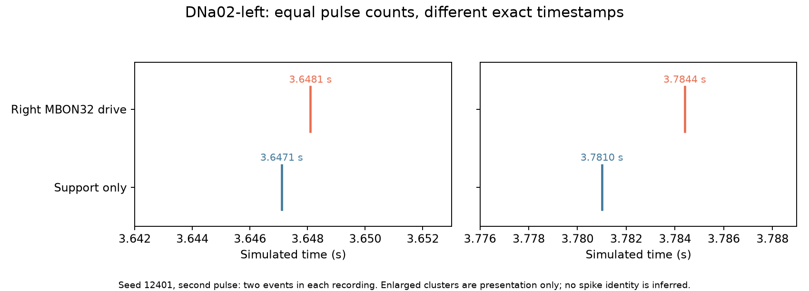

# Recovered MBON32 route and state audit

Completed 2026-10-07. Registered source/protocol/anatomy were published in `e364196` before execution. All 36 parent recordings and 24 isolated two-recipient replays are independently checked. No new full-network simulation, production controller change, learning, acceptance change or promotion occurred.

## Plain-language finding

The stimulated cells really affect the steering neurons. The signal is not disappearing because the simulator forgot to deliver it. The two tested direct links act as brakes, and one is four times stronger in the imported model. The stronger brake removes some steering spikes. The weaker brake changes when spikes happen, while leaving the number counted over half a second unchanged.

The odor-free test also leaves most candidate intermediate pathways quiet. Smell activates many more of them, including the cells with adaptation enabled. That makes sensory context a concrete question to test. It does **not** mean adding smell will repair steering: the existing odor trials have their own strong directional bias and inhibitory imbalance. Useful steering and learning remain unproven.

## Prediction and independent verification

Eight intact DNa02 replays predict the exact recorded spike ticks and 25 ms counts before any attribution or altered-input replay. All sampled voltage/g endpoints agree within `7.11e-15 mV`. These neurons have the original 2.2 ms refractory interval, 20 ms membrane time constant, 5 ms drive decay, -52 mV reset/rest, -45 mV threshold and 1.8 ms synaptic delay. Neither is adapted or directly stimulated.

Sixteen further two-neuron diagnostics remove one exact MBON32-to-DNa02 edge at a time while retaining all recorded source events. Each recomputes thresholds, resets and refractory gates. The untouched recipient stays exact. This is a conditional fixed-source intervention; the recurrent full network cannot respond to the removal.

The independent auditor imports neither Brian2 nor the runner/replay/delivery/timing helpers. It checks 8,640 raw chunk hashes and event/count parity, all 561 outgoing anatomical records, 36 derived profiles, population phases, signed delivery, generator requests and timing summaries. Dense event accumulation and closed-form integration reproduce all 48 recipient units across 24 replays with exact spike ticks/counts. Maximum independent errors are `1.28e-13 mV` in voltage and `2.49e-14 mV` in g. All 100 pinned sources remain unchanged. Ten focused boundary/sign/timing/serialization tests passed.

## Exact anatomy and actual delivery

| Source -> recipient | Exact source root | Exact recipient root | Imported sites/sign | Per-event g increment |
|---|---|---|---|---|
| MBON32 left -> DNa02 right | 720575940609959637 | 720575940604737708 | 40, inhibitory | -11 mV |
| MBON32 right -> DNa02 left | 720575940638526278 | 720575940629327659 | 10, inhibitory | -2.75 mV |

These increments are the model's voltage-equivalent synaptic drive, not measured biological currents. Anatomical counts scale model weights; they do not measure fourfold biological efficacy. Left/right labels here use soma annotations and the existing diagnostic mapping.

Across the unilateral pulses, the left link delivers 100 delayed arrivals and accepts 98; the right delivers 110 and accepts 109. Rejected events include spike-tick reset/refractory rejection. Accepted inhibitory delivery ranges from 440–638 mV/s for left stimulation and 143–159.5 mV/s for right stimulation. Refractory blocking is a small fraction here, not a supported main explanation for the absent right rate effect.

The full inventory contains 561 outgoing records, 4,375 represented anatomical sites and 512 distinct recipients. Of those recipients, 156 also have an imported direct record into one of the two DNa02 targets. This is a two-hop anatomical inventory; it does not establish functional transmission or select a unique relay. Exact LAL171/LAL074 labels remain absent. Four compound annotations for each are listed separately; no arbitrary root is promoted to either missing type.

## Rate and timing effects

| Seed / pulse | Support-only DNa02 L/R (Hz) | Left drive L/R | Right drive L/R | Both drive L/R |
|---|---|---|---|---|
| 12401 / 1 | 8 / 10 | 8 / 8 | 8 / 10 | 8 / 8 |
| 12401 / 2 | 4 / 12 | 4 / 8 | 4 / 12 | 4 / 8 |
| 12402 / 1 | 2 / 10 | 2 / 6 | 2 / 10 | 2 / 6 |
| 12402 / 2 | 2 / 14 | 2 / 8 | 2 / 14 | 2 / 8 |

Right drive changes DNa02-left exact timing in all four pulses, despite identical counts. Symmetric nearest-event maximum distances are 1.5, 3.4, 1.1 and 0.8 ms, respectively. Nearest events are a descriptive distance, not proof that a particular spike shifted identity. For example, seed12401's second pulse records events at3.6471/3.7810 s without direct drive and3.6481/3.7844 s with right drive.

Under fixed recorded sources, removing the right direct edge changes timing but changes pulse counts by zero in all four right-only pulses and all four bilateral pulses. Removing the left edge raises right DNa02 pulse rates by2,4,2,6 Hz in the left-only cases (and the same amounts in bilateral cases). The whole-network left-stimulation changes were2,4,4,6 Hz. That one partial discrepancy and the downstream timing changes leave room for indirect source effects; the direct link is not a complete causal decomposition of the recurrent response.

The original direct-capability direction result remains **0/4**. Fine timing sensitivity does not satisfy a rate-based steering criterion or justify promoting this decoder. No acceptance calculation was relaxed.

## Sensory operating-state comparison

These archives differ in seeds and MBON refractory policy as well as odor context. The comparison is descriptive. A matched sensory-context experiment is still required.

| During stimulated/odor pulses | Direct, no odor | Original odor | Local-adaptive odor |
|---|---|---|---|
| Active MBON outgoing recipients, of512 | 3–4 | 184–197 | 175–189 |
| Active two-hop intermediates, of156 | 1–2 | 42–47 | 44–52 |
| Adaptation-domain mean rate per neuron | 0 Hz | 115.8–120.7 Hz, adaptation disabled | 11.9–12.4 Hz, adaptation enabled |
| LAL170 mean rate per neuron | 0 Hz | 16–20 Hz | 16–27 Hz |
| LAL010 mean rate per neuron | 0 Hz | 0–2 Hz | 1–3 Hz |

DNa03, LAL018, PFL2 and PFL3 are silent in these fixed pulse observations. That is not proof that their anatomical routes cannot function under a different stimulus. The 395 adapted cells never spike in the direct archive; the candidate's cooldown is therefore unengaged in that operating state.

In all24 local-adaptive odor-pulse observations, right DNa02 has negative net accepted input (-4,586.45 to -1,601.60 mV/s); the exact AOTU019 group supplies45.6–56.0% of its accepted inhibitory input. This corroborates the earlier trace. Competing excitation and inhibition remain separate in `results.json`. Net phase totals alone do not predict threshold crossings. Earlier fixed-source removal of paired AOTU019 delivery did not restore opposed direction, so suppressing that group is not an established repair.

Only3 of512 outgoing recipients have saved state endpoints in the direct archive (two DNa02 cells and one AOTU019); only2 do in the odor archive. Remaining relay voltage/g/adaptation observations are unavailable. Their silence cannot be classified uniquely as subthreshold excitation, inhibition, absence of upstream drive or refractory effects. The saved endpoint voltage headroom is not a continuous-voltage measurement.

## Ranked explanation and next decision

1. **Unequal input efficacy and rate-readout operating state:** directly supported by the imported weights, high acceptance, exact native prediction and fixed-source edge removals. The weaker signal is real but does not alter these pulse counts. This is a model/controller suitability issue, not a demonstrated numerical bug.
2. **Unengaged sensory/relay state in the direct screen:** strongly supported descriptively. It justifies one matched context comparison; it does not establish that context repairs direction or that adaptation is the cause.
3. **Bias and competing inhibition when odor is present:** already observed in the existing matched original/adaptive archive. This is a reason to predict possible rate floors/asymmetry even after sensory recruitment.
4. **Point-neuron, sign and annotation assumptions:** unresolved biological uncertainty. Both MBON32 `known_nt` annotations are blank; their imported inhibitory signs agree with GABA `top_nt` predictions, but right prediction confidence is0.359 and its annotation has `outlier_seg` status. No sign, count, threshold or root is changed on that basis.
5. **Timing/reset/delivery implementation error for these recipients:** less supported by exact independent reconstruction. This narrow check does not establish correctness of every modeled neuron or the entire application.

Read [the next decision](../ROUTE_STATE_DECISION.md) and [the fixed comparison design](../SENSORY_CONTEXT_COMPARISON_SPEC_V1.md). The next full-network experiment has not been launched. Existing failed evidence and qualification gates remain authoritative.

## Runtime, storage and inspection

Main saved-run analysis plus24 tiny native replays:56.75 s, peak RSS0.822 GiB. Independent audit:28.50 s, peak RSS1.055 GiB. These are separate sequential analysis timings; they exclude setup/tests, plotting, registration and report writing. No full brain was recomputed. The local audit package used approximately96.4 MiB before final report/receipt additions; parents and checkpoints were preserved. More than198 GiB remained free, above the2 GiB reserve.

Start with the two figures and this report. `anatomical-inventory.json` maps exact roots/edges; `results.json` contains every fixed phase, delivery partition and timing comparison; `native-validation.json` and `independent-audit.json` give reconstruction evidence. Local `profiles/`, `inputs/` and `replays/` permit raw inspection. These arrays and the parent archives are excluded from the public GitHub snapshot; public summaries alone cannot reproduce the raw checks.
