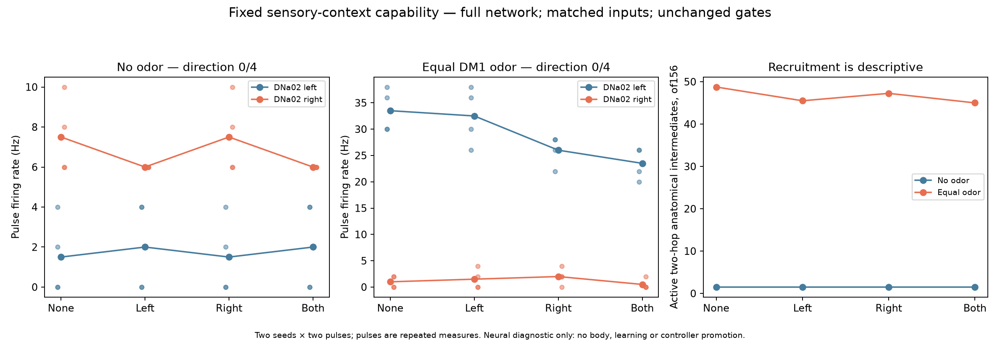

# Sensory context recruits activity but does not repair steering

Completed2026-10-07. All16 full-network trials on fresh diagnostic seeds12501/12502 finish; all3,840 chunks and128 original capability metric rows pass independent checks. Four fresh-process whole-state continuations and a60-chunk interruption/reconstruction are exact. No controller is promoted, no learning is run and no acceptance bound changes.

## Plain-language result

Adding smell makes the tested circuit behave differently. Many more candidate pathways fire, the adaptation cells become active, and the weaker right-side input starts changing average steering-neuron firing. But the left response is inconsistent, and activating both sides often produces a steering bias. The complete left/right capability check still fails in every comparison.

This resolves the narrow context question: the quiet operating state was masking a rate effect from the weaker input. It was not the only obstacle to useful steering. We will stop expanding this MBON32/DNa02 tuning branch and specify an explicit engineered readout of neural activity. Reliable embodied choices, vision and learning remain separate goals.

## Frozen comparison

Executable sources/protocol were committed and published in `7ca215e` before computation. Each of two contexts receives four direct MBON32 cases (`none`, `left`, `right`, `both`) on the same two fresh seeds. Both contexts retain the full138,639-neuron graph,15,091,983 aggregated records and54,492,922 represented sites; original signs/weights,395-cell local adaptation at450ms/13.5mV,65Hz DNp09 support,50Hz direct stimulation,68.75mV external jumps and the frozen motor decoder.

The odor context applies DM1 concentration0.5 at both antenna encodings during[0.3,0.8) and[3.3,3.8) seconds only: nominal25Hz per exact DM1 receptor. DM2/vision remain zero. This is engineered encoding. Both directly stimulated MBON roots stay zero refractory in every arm, including direct-none. Ordinary input refractory conventions also remain unchanged.

The new ordinary-input monitor observes generator delivery only. Before the sixteen trials, the wrapper reproduces all original neural/input/motor arrays across36 historical no-odor left-drive windows, including the first pulse. Direct input uses the separate seed+100000 stream; ordinary inputs draw the same full matrix every window. Thus support and direct events pair across contexts/cases while odor events pair within context. Both requested and actually delivered generator events match independently reconstructed trains.

Each context is evaluated against **its own same-seed direct-none control** with the unmodified original evaluator. Recovery windows remain[100,120) and[220,240); all direction/response/recovery/support/burst inequalities remain unchanged. Scalar conversion in the new preregistered output codec preserves values, including false NumPy booleans, without editing any historical source.

## Gate outcomes

Counts are diagnostic seed/pulse comparisons, not independent animals. Each context has four complete direction checks and twelve stimulated-case response/recovery/burst checks.

| Original capability family | No odor | Equal DM1 odor |
|---|---:|---:|
| Complete direction | **0/4** | **0/4** |
| Target response and renewed response | 12/12 | 12/12 |
| Individual/signed recovery | 12/12 | 12/12 |
| Matched support perturbation | 24/24 | 24/24 |
| Late100ms PN/MBON burst bounds | 12/12 | 12/12 |

The full direction criterion requires left delta≥5Hz, right delta≤-5Hz, bilateral delta within5Hz **and** the existing10Hz separation/bracketing rule. Subcriteria remain visible:

| Direction subcriterion | No odor | Equal DM1 odor |
|---|---:|---:|
| Left delta≥5Hz | 0/4 | 0/4 |
| Right delta≤-5Hz | 0/4 | 3/4 |
| Bilateral delta within5Hz | 4/4 | 1/4 |
| Existing10Hz separation and strict opposition | 0/4 | 1/4 |

That one existing-opposition pass is a partial result, not a complete capability pass. Its left delta is4Hz, below the unchanged5Hz bound. Other comparisons have wrong-signed or absent left effects and biased bilateral effects. Neither criteria nor input strengths were adjusted after inspection.

## Exact signed effects

All values below are DNa02-left minus DNa02-right pulse-average firing. Delta subtracts the direct-none arm in the **same context and seed**.

| Context | Seed / pulse | None contrast | Left delta | Right delta | Both delta | Left–right separation |
|---|---|---:|---:|---:|---:|---:|
| No odor | 12501 / 1 | -6Hz | +4Hz | 0Hz | +4Hz | 4Hz |
| No odor | 12501 / 2 | -2Hz | 0Hz | 0Hz | 0Hz | 0Hz |
| No odor | 12502 / 1 | -6Hz | 0Hz | 0Hz | 0Hz | 0Hz |
| No odor | 12502 / 2 | -10Hz | +4Hz | 0Hz | +4Hz | 4Hz |
| Equal odor | 12501 / 1 | +28Hz | -4Hz | -4Hz | -8Hz | 0Hz |
| Equal odor | 12501 / 2 | +36Hz | -6Hz | -12Hz | -16Hz | 6Hz |
| Equal odor | 12502 / 1 | +30Hz | +4Hz | -8Hz | -4Hz | 12Hz |
| Equal odor | 12502 / 2 | +36Hz | 0Hz | -10Hz | -10Hz | 10Hz |

With no odor, direct-none DNa02-left fires0–4Hz and right6–10Hz. With equal odor, left fires30–38Hz and right0–2Hz. The context changes the operating point substantially. Right direct input now reduces the signed rate in all four pulse comparisons, whereas its no-odor pulse-average effect is zero. Its changed contrast can involve both recipients and indirect recurrent effects; this experiment does not uniquely assign the cause to a single edge or relay.

Stimulated MBON target gains are46–64Hz without odor and46–62Hz with odor. Effective target stimulation, renewed response and quiet recovery persist. Target response is therefore distinct from successful steering.

## Engagement and interpretation

| Descriptive activity measure | No odor | Equal DM1 odor |
|---|---:|---:|
| Whole-trial active neurons | 104–132 | 7,148–7,304 |
| Adaptation-domain spikes per trial | 0 | 4,631–4,842 |
| Adaptation-domain pulse mean rate per neuron | 0Hz | 11.70–12.29Hz |
| Active anatomical two-hop intermediates during pulses, of156 | 1–2 | 43–53 |

Input pairing and the fixed model make this a matched sensory-context manipulation. It supports a context-dependent rate response in this model. Both arms retain adaptation, so it does **not** isolate adaptation's causal contribution. Anatomical intermediate membership and firing do not identify a unique functional pathway. Two seeds and repeated pulses cannot establish population confidence, biological fidelity, unfamiliar-layout behavior or learning.

The prior PN direction/gradient failures remain authoritative; this direct-input experiment does not retest them. No physical body, obstacle, vision or predator was present. Frozen motor commands are audited calculations, not observed movement.

## Independent checks and runtime

The auditor recomputes each raw count, clock, population rate, motor command, requested/delivered event train, engagement summary and context-specific capability criterion without importing the neural evaluator. All3,840 chunks rehash; all128 metric rows match. Motor error is zero. Support events are identical across contexts/cases; direct trains are identical across contexts and match their bilateral-side counterparts. Four checkpoint receipts/file hashes validate, with full-network voltage/g/adaptation continuation errors zero. The interrupted60-chunk prefix is preserved and reconstructed exactly.

Main coordinator including trials, historical parity, deliberate interruption, four fresh-process continuations and evaluation:947.97s (**15min48s**). Independent audit:13.69s. The16 main worker times sum to868.05s, with largest peak RSS2.493GiB. These timings exclude test/setup/publication/report writing and do not measure the whole application or body. Single-worker throughput is roughly0.11 simulated seconds per wall second; this is not live real-time operation.

Swap scheduling samples increase from3.967 to4.547GiB, with about86.9MiB additional swap-out between samples. Other processes can contribute; this is a session measurement, not an experiment-only allocation. Local package storage before final delivery additions is about0.979GiB, mostly four checkpoints. The2GiB disk reserve remains enforced; no recording/checkpoint is deleted.

Read `protocol.json`, `results.json`, `independent-audit.json`, `no-context-parity.json` and `interruption-test.json` for exact evidence. Raw `trials/` and full checkpoints remain local and excluded from GitHub. Public summaries alone cannot reproduce raw-data checks.

## Next action and remaining goal

The stopping rule selects [the engineered neural-readout proposal](../ENGINEERED_NEURAL_READOUT_PROPOSAL_V1.md); it is not implemented or qualified yet. [The decision](../CONTEXT_CAPABILITY_DECISION.md) closes this fixed native-route tuning branch. [The goal-status note](../END_GOAL_STATUS.md) separates verified neural runtime/recovery from still-open reliable direction, vision, embodiment, learning and end-to-end delivery. No whole-project completion claim is made.
