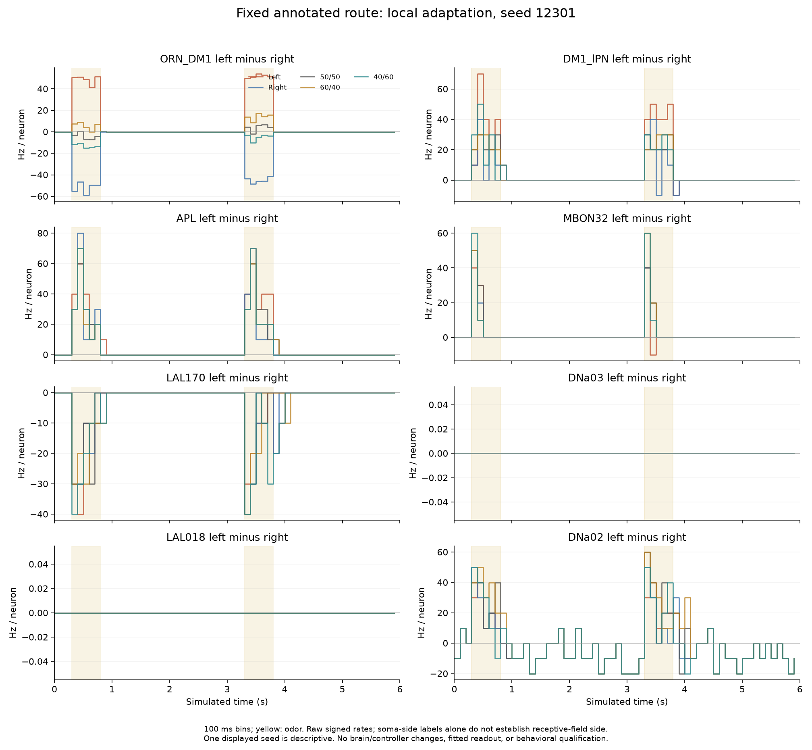
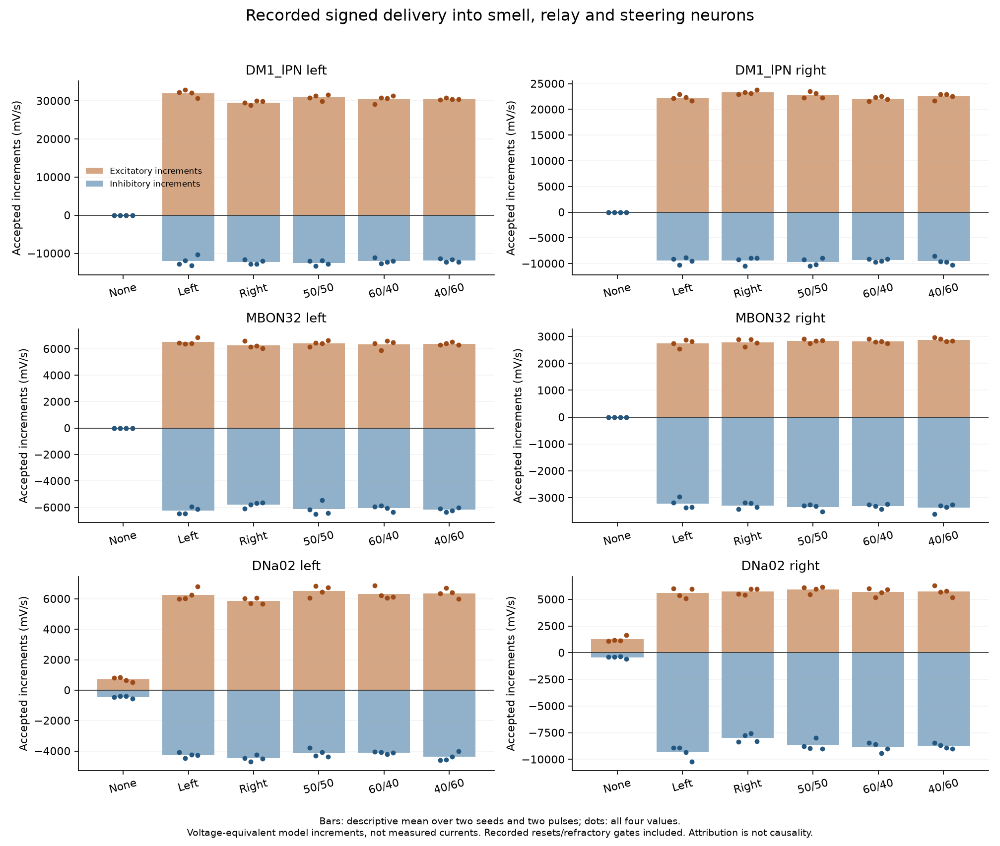

# Sensory-to-steering trace: the recovered circuit remains biased

2026-10-07. Completed offline analysis of all **28 saved full-network trials** and an independent event-by-event check. No new brain simulations, controller changes, parameter fits or acceptance changes occurred. The local-only adaptation candidate retains its previously validated recovery improvement. The original direction and gradient gates remain failed.

## Plain-language interpretation

The brain receives different signals when odor is on the left versus the right. Further along the sampled pathway, however, both inputs produce a similar preference for one side. It detects odor and changes activity; its current conversion from that activity into a steering command is unsuitable for choosing the odor's direction.

The cooldown stopped the smell circuit from staying active after the odor disappeared. It did not make the two hemispheres have equal effective gain or establish a working sensory-to-steering transformation. These are separate problems. We now have specific recorded neurons and connections to investigate, instead of another broad cooldown sweep.

## Fixed scope and provenance

The analysis protocol and sources were published in commit **403581662ced89b5fbe445ee9d3c845398011886** before execution. The existing archive already had known failed directional results; this is a retrospective diagnostic, not a new held-out validation.

Both models, both seeds (12301/12302), both pulses and all seven cues are included. Populations were selected by exact annotation labels and a published candidate steering route, plus fixed olfactory/MB/LH/CX classes. The root manifest contains **9,900 distinct population members**. All recorded network spikes remain available in the underlying full-network archive; these population summaries do not establish what every other neuron encodes.

Rayshubskiy et al. connect bilateral DNa02 activity to steering and describe candidate sensory routes involving MBON32 and parallel excitation/inhibition. This supports inspecting those populations, not expecting uniform synthetic DM1 stimulation to reproduce natural navigation. We reviewed Figure 7 and the accompanying discussion in the [primary PDF](https://cdn.elifesciences.org/articles/102230/elife-102230-v1.pdf), pages 13–14. No exact-root physiological parameters were obtained from that schematic.

Exact `cell_type` matches for LAL171/LAL074 are unavailable. Annotation inspection finds four `LAL171,LAL172` and four `LAL074,LAL084` compound-label candidates. Those labels do not identify which individual root has the published type. They were not silently substituted into the frozen populations. See `annotation-ambiguity.json`.

## Where side information is represented

These are mean rates per neuron over the two seeds and two pulses. The four values are repeated measurements of two seeded fly states, not four independent animals. Means do not replace the original gates.

| Recorded population | Left odor: left/right Hz | Right odor: left/right Hz |
|---|---:|---:|
| DM1 receptors | 50.56 / 0.59 | 0.30 / 49.73 |
| Selected DM1 PNs | 162.0 / 124.5 | 145.0 / 131.5 |
| Kenyon-cell class | 5.09 / 2.29 | 4.94 / 2.19 |
| MBON32 | 23.0 / 10.5 | 23.0 / 8.5 |
| DNa02 | 27.5 / 1.0 | 20.5 / 2.0 |

The receptor difference reverses sign correctly. Selected PN magnitudes distinguish the binary cases, but left-minus-right remains positive. The broad Kenyon-cell mean is also larger on the left for either cue; a class mean cannot establish that its full neuron-level activity vector lacks side information. MBON32's sampled whole-pulse contrasts are 6–16 Hz and remain positive for all 24 non-none pulse observations. DNa02 contrasts are 12–46 Hz and likewise remain positive. The sampled route does not turn the receptor opposition into opposing commands.

The gradient difference is already distinct at the receptors: mean 60/40 exposure yields approximately **29.96/20.20 Hz**; 40/60 yields **19.91/30.00 Hz**. In contrast, the four selected-PN gradient separations remain **0, 2, 4 and 6 Hz**, with the original equal-input bracketing failures preserved. MBON32's corresponding separations are **−2, 2, 2 and −2 Hz**. Switching to this relay's raw subtraction would not solve the tested gradient problem.

Inspecting the first 100 ms does not rescue a consistent sign reversal: both unilateral PN onset contrasts are positive in all four comparisons, MBON32 onset contrasts are positive, and DNa02 onset contrasts are positive. Other temporal or neuron-level features are not ruled out; no decoder was searched or fitted here.

Both DNa03 cells, both LAL018 cells, and the annotated PFL2/PFL3 populations have zero recorded spikes throughout the 14 candidate trials. LAL170 is active, with a greater right-side rate under either unilateral cue. These observations show that some candidate relays are unused in this modeled operating state. They do not invalidate the biological pathways.

## Signed delivery explains a concrete output imbalance

Delivery uses the graph's existing signs and delays. Recorded spikes determine each recipient's reset/refractory acceptance gate. The quantities below are **voltage-equivalent synaptic increments in mV/s**, not measured membrane currents. Excitatory and inhibitory magnitudes are retained separately. Their integrated difference alone cannot predict spikes: timing, voltage dynamics and resets matter.

| Candidate cue | Target | Accepted positive | Accepted negative magnitude | Signed net |
|---|---|---:|---:|---:|
| Left | Left DNa02 | 6,269 | 4,265 | +2,004 |
| Left | Right DNa02 | 5,611 | 9,345 | −3,734 |
| Right | Left DNa02 | 5,870 | 4,478 | +1,392 |
| Right | Right DNa02 | 5,719 | 7,993 | −2,274 |

The right output receives substantial positive input, but greater negative delivery for either cue. Its signed accepted total is negative in **all 24 candidate odor-pulse observations**. The left output's positive/negative balance differs substantially. Directly observed right-DNa02 voltage samples also become more negative during odor; all extrema in this package are over 25 ms endpoint samples, not continuous voltage limits.

The exact left AOTU019 root **720575940633556644** supplies **45.6–56.0%** of accepted negative input into the right DNa02 during every one of those 24 observations. In the representative left-cue first pulse (seed 12301), its contribution is −4,395.6 mV/s. Other substantial sources include LAL051 and LAL112. The counterpart right AOTU019 root, **720575940631517251**, also inhibits the left output but contributes less in that representative observation. These are source-attribution results, not proof that AOTU019 alone causes the full-network failure. Earlier broad inhibitory lesions already failed to establish useful odor direction; deleting the largest negative source is not an established repair.

Earlier in the route, the left PN receives greater accepted positive DM1 receptor delivery for either unilateral cue: approximately **18,633 versus 11,703 mV/s** into left/right PNs for left odor, and **15,658 versus 12,615 mV/s** for right odor. ALLNs still contribute roughly 40–45% of their positive delivery during unilateral pulses. This differs from the earlier >99% result during odor-free persistent activity in failed PN-adaptation models: it is a different model and time window. Quiet recovery does not remove all local contributions during stimulation.

Kenyon cells supply approximately **3,285 versus 1,125 mV/s** of accepted positive input into left/right MBON32 for left odor, and **3,212 versus 1,110 mV/s** for right odor. MBON32 also receives large opposing inputs from APL, LAL112 and other sources. Its two sides are not operating at equivalent input scales. These data are consistent with propagation of gain/balance asymmetry; they do not identify a unique causal route or justify a morphology-derived normalization.

Many major relay sources have an empty `cell_class` while retaining an annotated `cell_type`. They are grouped as class unavailable rather than assigned invented classes. Imported signs are used unchanged; neurotransmitter labels do not establish receptor kinetics or biological currents.

## What is and is not a bug finding

1. **Gain and operating-state mismatch is the leading model-level hypothesis.** The previously validated unitary DM1 measurements already found larger effective left-PN gain for either input side. This trace finds unequal pulse delivery, a similar MBON32 response for either cue, and same-sided descending balance. Uniform point-neuron properties and synthetic encoding may not preserve the biological transformation. The trace does not quantify the separate causal roles of gain, nonlinear saturation, recurrence and inhibition. Firing rates are below the hard refractory ceiling; that alone does not exclude other forms of saturation.
2. **The downstream inhibitory pathway is a specific discriminating target.** Right-DNa02 inhibition and the exact AOTU019 contribution are repeatable observations. A conditional replay or targeted capability experiment can investigate them. Modifying signs or weights to obtain a desired direction would require a separately declared model change and fresh validation.
3. **Support and missing physiological state remain relevant assumptions.** The no-odor mean DNa02 rates are 3/10 Hz, with the opposite signed baseline bias. Direct DNp09 support event trains match exactly across every cue and both models for each seed. A changed support stimulus therefore does not explain cue differences, but the common support can still affect network operating state. Zero basal firing, unmodeled receptor/neuromodulator effects and ambiguous annotations remain limitations.
4. **No checked numerical/evaluator defect explains these results.** New independent delivery calculations agree, and the earlier raw-spike, motor, clock, checkpoint and original-evaluator audits remain valid. This is a bounded finding, not proof that the application contains no bugs.

## Verification and runtime

- Rehashed and checked all **6,720** recording chunks.
- Reconstructed g/adaptation at all 240 endpoints for **8 independently observed targets per trial**. Maximum errors: **5.68 × 10⁻¹³ mV** for g and **1.35 × 10⁻¹² mV** for adaptation, below the frozen 10⁻¹⁰ bound. Ten additional route targets have reconstructed g without independent saved state observations; membrane voltage is not reconstructed.
- Independent audit uses a direct last-spike search at each delayed arrival rather than the analyzer's sparse reconstruction or gate helper. **36,288 signed totals** agree within **1.75 × 10⁻¹⁰ mV/s**. It also checks **42,336 individual phase rates**, all 28 population profiles, and identical support event trains.
- Ten helper regression tests pass, including half-open arrival phases, chunk boundaries, reset/refractory release, opposing-source cancellation and adaptation decay. Both scientific figures were visually inspected.
- Offline analysis took **517.21 seconds (8 minutes 37 seconds)**. Peak analyzer RSS: **0.927 GiB**. No full-brain trial was rerun. This is analysis-process memory, not full-application or simulation-worker memory.

`results.json` retains all fixed phases, individual named-route rates, source rankings, state coverage and reconstruction checks. `paired-summary.json` retains paired values and descriptive means. Raw trials/checkpoints and derived `profiles/*.npz` remain local. The public GitHub snapshot omits those arrays and therefore cannot independently reproduce the raw-event audit by itself.

## Next decision

Read `../STEERING_TRACE_DECISION.md`. Start with a registered, small recorded-input diagnostic that recomputes recipient voltage, resets and gates, validating the unchanged replay first. Then use a bounded direct-MBON32 capability comparison under the recovered candidate if needed to distinguish an upstream representation problem from downstream inability to generate opposite commands. Such direct stimulation is a diagnostic, never an odor-navigation controller. No live controller, baseline subtraction, physiological gain correction or learned decoder has been introduced.
