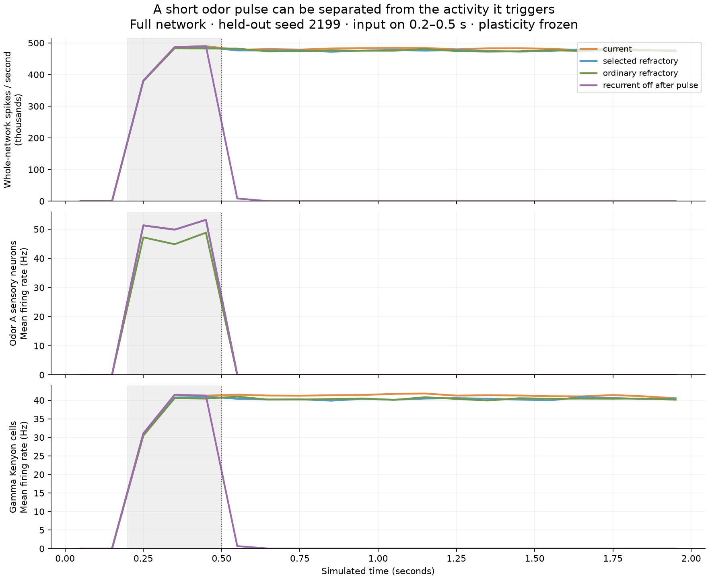
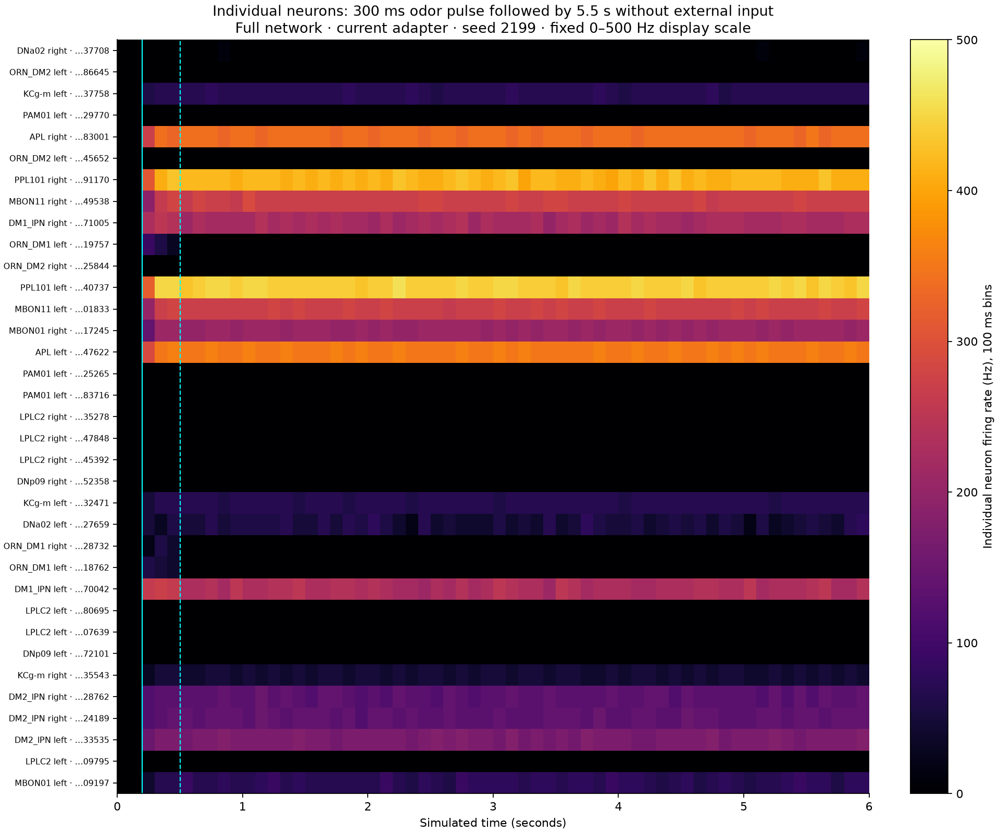

# Fly Garden — Stage 2 persistent-activity diagnosis

The diagnostic isolates stimulus-driven activity from recurrent persistence, without changing the live controller or training weights. Full network: 138,639 neurons and 15,091,983 connection records. Results cover 87 trials, two calibration seeds plus one prospectively specified held-out seed. This is not a navigation or learning evaluation.

## Main measured results

Unstimulated trials produced 0 total spikes. A 300 ms odor-A pulse produced an average of 480,869 spikes/s in the final 500 ms of the 2-second trials, with all external input removed. The selected-input refractory convention produced 476,686 spikes/s. Disabling recurrent delivery after the same pulse produced 0 spikes/s in that tail.

Disabling recurrent delivery extinguished the measured post-pulse activity in all three seeds while the intact network remained active. This establishes that recurrent connections sustain this response in the tested model. It cannot identify a unique responsible circuit, establish biological firing patterns, or prove the network would work with a natural sensory interface. Constant walking input is tested separately; persistent odor-triggered activity does not require the arena, walking controller, predator, renderer or learning.

An independent native reference check used the original pinned construction functions, original reset and actual per-neuron PoissonInput, with the same 300 ms 50 Hz odor-A pulse followed by 5.5 seconds without input. Its final rate was 475,582 spikes/s. That check uses a different RNG stream from our adapter; it confirms the response also occurs in the upstream setup, rather than establishing exact stochastic equivalence.

## Refractory and amplitude probes

Mean across three seeds; 50 Hz odor-A input for 300 ms. Recovery tail is the final 500 ms, not a single sample.

| Diagnostic profile | During-pulse spikes/s | Recovery-tail spikes/s | Tail-active neurons |
| --- | ---: | ---: | ---: |
| current | 450,139 | 480,869 | 8,238 |
| selected_refractory | 447,259 | 476,686 | 8,208 |
| ordinary_refractory | 446,500 | 476,386 | 8,196 |
| jump_20pct | 452,242 | 481,322 | 8,244 |
| jump_10pct | 431,619 | 481,053 | 8,238 |
| recurrent_off_after_pulse | 450,139 | 0 | 0 |

`selected_refractory` disables refractory periods only for populations selected for stimulation, retained for that trial. `ordinary_refractory` keeps 2.2 ms on every neuron. `jump_20pct` and `jump_10pct` change only the external voltage jump to 13.75 mV and 6.875 mV. These are engineered diagnostic probes, not physiology-derived replacements. The original 68.75 mV artificial activation is retained in the reference. `recurrent_off_after_pulse` disables recurrent delivery at 0.5 seconds; no cells or edges are removed from import, but it is an explicit lesion and must never be presented as a full-function interactive model.

## Input-rate dose response

| Odor-A input rate (Hz) | During-pulse spikes/s | Recovery-tail spikes/s |
| --- | ---: | ---: |
| 5 | 418,982 | 481,487 |
| 25 | 442,810 | 482,393 |
| 100 | 461,167 | 481,991 |

Rate and voltage jump are distinct settings. A lower input frequency can still trigger a self-sustaining response. No setting was promoted based on making the visualization dimmer or more variable.

## Longer recovery

Same 300 ms pulse, now followed by 5.5 seconds with no external stimulation. Mean over three seeds, final 500 ms:

| Profile | Recovery-tail spikes/s | Tail-active neurons |
| --- | ---: | ---: |
| current | 480,357 | 8,241 |
| selected_refractory | 475,551 | 8,208 |
| recurrent_off_after_pulse | 0 | 0 |

## Circuit response and internal-state evidence

`analysis.json` contains paired odor-A/B rate-vector comparisons for sensory neurons, gamma Kenyon cells, MBONs and DNp09. It also contains exact-root-ID internal-state summaries: delivered positive and negative recurrent voltage increments, external increments, membrane voltage and synaptic state. Positive/negative increment totals are model bookkeeping; they are not physical currents or a validated biological excitation/inhibition ratio. Counters honor the refractory gate.

`bins.json` retains each population's response, individual inspected-neuron rates, descending motor readout, near-refractory-limit counts and sensory events. Selected high-firing neurons' coefficient of variation and silence frequency are descriptive metrics with selection bias, not evidence that the entire brain is static. The switch-A/B trial checks responses without resetting neural state between cues. Exact raw spikes and per-neuron counts cover the entire network; internal state was sampled at 1 ms for 35 annotated neurons, not all cells.

## Validation, storage and runtime

Verified 2,100 committed 100 ms windows and 69,331,938 raw spikes against per-neuron monitor counts. All hashes, timestamp bounds and finite-state checks passed. No external input was recorded during baseline/recovery. Observer-enabled and observer-disabled full-network tests agreed on spikes/counts and final v/g state. A separate two-cell signed-delivery test verified refractory blocking and 1.8 ms delivery delays. Learning stayed frozen, plasticity weights stayed unchanged, and sources retained their committed identity.

Also verified 60 native reference windows with 2,750,772 raw spikes. Native confirmation took 172.2 wall seconds, after the main simulation worker finished.

Aggregate active worker wall time (excluding the storage pause): 1987.6 seconds. Peak worker RSS: 2.66 GiB (macOS RSS accounting; excludes live app). Evidence currently occupies 288.7 MiB. One diagnostic simulation worker; no render jobs. A 2 GiB free-space reserve is checked before writing. Completed windows are committed before manifest publication. Earlier diagnostic setup failures are retained separately and excluded from these results.

## Decision and next stage

No production brain configuration is changed or promoted. Persistent activity survived both refractory conventions, reduced input amplitudes, low input rates and the independent upstream check. None of these tested settings provides a validated correction. Only about 8,200 neurons (roughly 6% of the modeled network) were active in the odor recovery tail; this is not evidence that every neuron is continuously firing.

The current left/right DNp09 motor readouts emitted zero spikes during both isolated odor pulses in every seed. Sensory activation therefore does not demonstrate odor-driven walking with this decoder. Stage 3 should establish an annotated sensory-to-descending pathway and verify cue-dependent motor outputs before reconnecting the arena. Diagnose the persistent circuit separately, using documented model assumptions and targeted circuit tests; do not weaken recurrent weights merely to change the display. Learning and navigation remain unproven.

Source: [pinned released model](https://github.com/eonsystemspbc/fly-brain/tree/a3db62f9436074e485c0278290c2164ed6150808). Brian's refractory flags also make flagged variables ignore incoming changes while refractory: [official Brian2 documentation](https://brian2.readthedocs.io/en/stable/user/refractoriness.html).

Reproduce with `.venv-next/bin/python scripts/diagnose_persistent_activity.py`, then `.venv-next/bin/python scripts/check_native_activity_recovery.py ABSOLUTE_EVIDENCE_FOLDER`, then `.venv-next/bin/python scripts/report_activity_diagnostics.py ABSOLUTE_EVIDENCE_FOLDER`. A fresh folder is required; earlier recordings/checkpoints are never overwritten.

