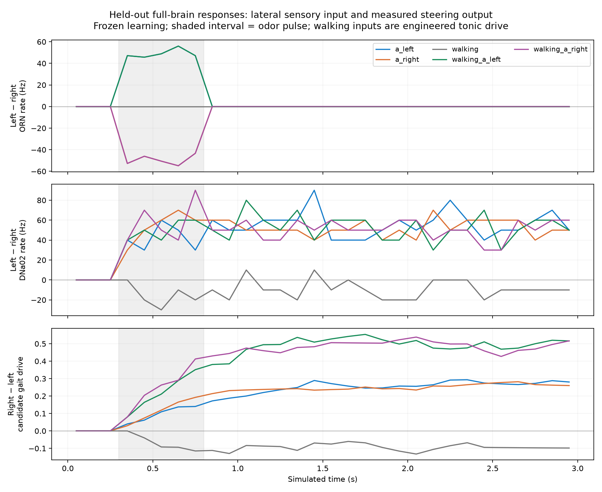
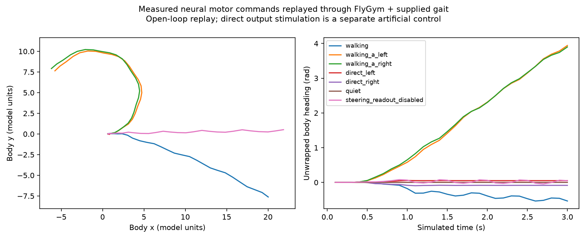

# Fly Garden — Stage 3 sensory-to-movement pathway

## Result

Completed 36 isolated full-network trials (138,639 neurons; 15,091,983 connection records), with three matched seeds including held-out 3199. Verified 1,080 count windows containing 30,617,518 spikes. Learning and recurrent weights remain fixed. The live application was not altered.

The tested odors caused a same-side DNa02 bias instead of reliable left/right cue tracking. The body followed that bias: walking-plus-left-odor changed heading by 3.943 rad; walking-plus-right-odor by 3.900 rad, both in the same direction. Disabling the steering readout reduced the matched replay to 0.050 rad.

Sensory gate: **FAIL**. Direct output-to-body direction control: **PASS**. Candidate decoder: **not promoted**. Do not reconnect this candidate as a validated sensory controller.

## What was implemented

A versioned exact-root-ID mapping keeps left/right ORN_DM1 and ORN_DM2 inputs separate. Synthetic 50 Hz odor activation is an engineered encoding, not a natural receptor response. The pinned reference stimulation convention sets refractory to zero only on the neurons stimulated in that condition. Quiet, left, right, bilateral, sequential switch, walking-only, walking-plus-odor, and direct steering controls retain continuous state within each 3-second trial. Ordinary trials independently reconstruct the full network.

`flygarden/descending.py` is an unpromoted candidate: forward drive uses bilateral DNp09 mean rate; steering uses DNa02 left-minus-right rate. Rate scaling, smoothing and bounds are engineered, fixed before trials, and read no odor values, positions, routes, rewards or hidden world state. The supplied walking controller coordinates the legs. Candidate commands and all annotated rates are saved per 100 ms. Counts cover every modeled neuron; raw spike timestamps were not recorded in this phase.

DNa02 was chosen before results because experimental work connects it to ipsilateral steering and lateralized olfactory responses. The research uses broader olfactory stimulation; our two ORN types are not an exact reproduction. See [steering circuit research](https://elifesciences.org/articles/102230) and [descending steering research](https://pmc.ncbi.nlm.nih.gov/articles/PMC12778575/).

## Cue gate

Fixed acceptance window: first 200 ms of the odor pulse. Positive left and negative right changes must each exceed 5 Hz relative to the matched quiet/walking baseline and hold on both calibration seeds plus the held-out seed. No fitted baseline offsets or motor gains were applied to the decoder. Recovery and later responses remain available in the raw bins; early responses alone are not navigation proof.

| Cue | Seed | Left-cue evoked left−right DNa02 (Hz) | Right-cue evoked left−right DNa02 (Hz) | Gate |
| --- | ---: | ---: | ---: | --- |
| a | 3101 | 60.0 | 55.0 | fail |
| b | 3101 | 50.0 | 40.0 | fail |
| walking_a | 3101 | 40.0 | 55.0 | fail |
| a | 3102 | 55.0 | 70.0 | fail |
| b | 3102 | 50.0 | 50.0 | fail |
| walking_a | 3102 | 50.0 | 50.0 | fail |
| a | 3199 | 35.0 | 40.0 | fail |
| b | 3199 | 55.0 | 55.0 | fail |
| walking_a | 3199 | 55.0 | 65.0 | fail |

## Anatomical audit

`anatomical-routes.json` records exact IDs, source hashes and representative directed shortest paths from each ORN population to DNa02, DNp09 and DNg13. All imported connection records enter the topology, including inhibitory and zero signed weights. A path demonstrates anatomical reachability, not transmission, excitatory causality, or unique circuit identity. No connections were thresholded or altered in neural simulations.

## Body connection

The held-out recorded neural commands were replayed through the actual FlyGym body for seven conditions including two supplementary controls. Body simulation advances at its existing physics/gait clocks, with finite-state checks and 30 FPS pose sampling. This is open-loop motor replay, not a fly sensing and responding to its changing location. A quiet replay and a replay with DNa02 readout set to zero provide output controls; the latter disables only the decoder readout, not the recorded brain. These controls were added after observing the same-side response and do not alter the original cue gate. Artificial direct left/right DNa02 stimulation tests the neural output and gait connection separately; it cannot establish odor-driven steering. Falls are retained in the results.

## Decision and next work

The present sensory-to-steering configuration did not meet the gates. Keep the live controller unchanged. Inspect the documented left/right response and signed intermediate paths before choosing an additional predeclared circuit test. Do not convert odor gradients directly into turning commands or change neuron weights merely to obtain attractive movement.

This phase does not demonstrate learning, biological fidelity, obstacle vision, or navigation. The persistent activity diagnosed in Stage 2 remains a separate limitation.

## Runtime and verification

Neural execution: 542.4 active wall seconds. Peak neural worker RSS: 2.28 GiB (macOS process accounting, excludes the live app). Initial five body replays: 21.7 seconds; supplementary control runtime was not recorded. Raw evidence: 28.7 MiB before these plots/report. Body replay source identity and finite results were verified. Three decoder/schedule tests passed. A fresh held-out repeat matched every per-neuron 100 ms count, external event count, population rate and motor command; raw spike timing and internal-state parity are not claimed.

## Artifacts and reproduction

- `protocol.json`: committed mappings, seeds, gates and source hashes.
- `trials/*/manifest.json`, `bins.json`, `window-*.npz`: intact trials and per-neuron counts.
- `anatomical-routes.json`: topology and signed representative edges.
- `body-replay/*.json`: actual physical traces and sampled poses.
- `analysis.json`, `verification.json`: machine-readable results and checks.

Run `scripts/diagnose_sensorimotor_pathway.py NEW_FOLDER`, then `scripts/map_sensorimotor_routes.py NEW_FOLDER`, then `scripts/replay_descending_body.py NEW_FOLDER`, then `scripts/check_sensorimotor_replay_controls.py NEW_FOLDER`, then `scripts/report_sensorimotor_pathway.py NEW_FOLDER`, using `.venv-next/bin/python`. Existing complete trials are retained on resume; incomplete attempts must be preserved before retry. The 2 GiB free-space reserve is enforced; no automatic deletion. Decoder/schedule tests: `tests/test_descending.py`.
