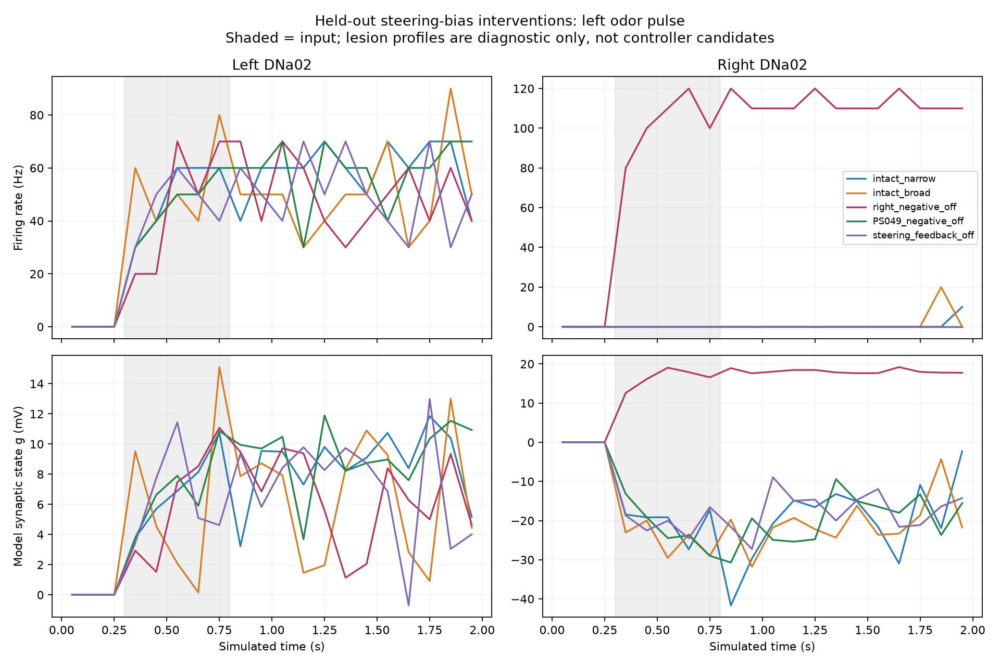
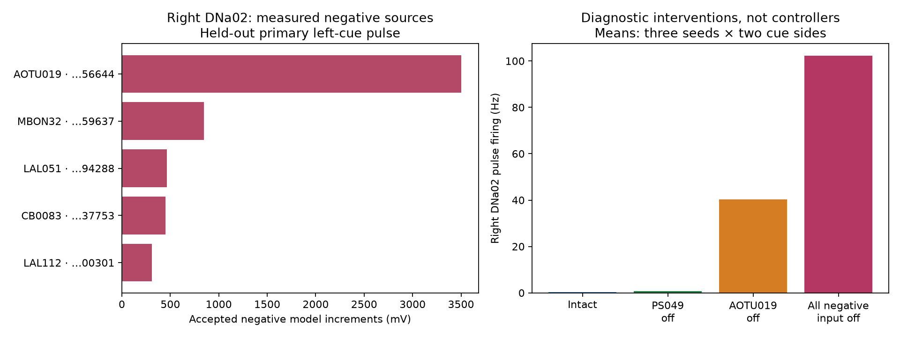

# Fly Garden — Step 4 steering-bias diagnosis

## Result

Completed 36 matched full-network trials, plus a full-network observer on/off check. Verified 720 100 ms windows and 29,078,445 raw spikes. Both DNa02 neurons were sampled every 0.1 ms. Source-resolved delayed, refractory-gated delivery reconstructions matched the live diagnostic counters in every trial.

Right DNa02 mean firing during the narrow odor pulse: 0.3 Hz intact; 102.3 Hz with its negative input blocked; 0.7 Hz with PS049 negative input blocked. Left DNa02: 51.7 Hz intact; 49.0 Hz with both steering neurons' outgoing feedback blocked. These are six-trial means (two cue sides, three seeds), not population variability across biological animals.

Broad intact sensory candidate: **fails** the predeclared combined cue-tracking and recovery gate. No candidate is promoted; the live brain and its learned parameters are unchanged.

## What the tests mean

Negative-input lesions intervene on signed weights in this simplified model. Their response can establish model causal dependencies, not that inhibition is biologically faulty. PS049 was selected prospectively as the largest individual negative anatomical source on both sides, before measuring its delivered activity. The delivery ranking uses actual source spikes, 1.8 ms delays and the postsynaptic refractory gate, rather than synapse count alone. Recorded positive/negative voltage increments are not physical currents, and resets can discard a delivered increment later in the same timestep.

Broader stimulation recruits annotated left/right ORN types, instead of only ORN_DM1. This tests narrow-input coverage as a hypothesis; it is still artificial activation, not a natural odor receptor encoding. 1114 left and 1132 right ORNs are mapped by exact root ID; 29 ORNs with unavailable side annotation are explicitly excluded from stimulation, but retained in the network. The broad groups can differ in neuron count.

All trials import 138,639 neurons and 15,091,983 connection records. Lesions retain those records but zero the listed weights, so they are **not full-function intact controllers**. Ordinary cells retain 2.2 ms refractory; only actually stimulated ORNs use the released zero-refractory convention. No tonic walking, direct steering input, arena state, reward or learning is supplied.

## Intervention manifest

| Profile | Records zeroed | Anatomical synapses represented by those records |
| --- | ---: | ---: |
| intact_narrow | 0 | 0 |
| intact_broad | 0 | 0 |
| right_negative_off | 274 | 4,794 |
| left_negative_off | 275 | 4,387 |
| PS049_negative_off | 2 | 731 |
| steering_feedback_off | 411 | 1,623 |

## Cue tracking and recovery

Acceptance requires left-minus-right DNa02 >5 Hz for a left cue and <−5 Hz for a right cue in the first 200 ms of input, on both calibration seeds and held-out 4199. Both outputs must also return below5 Hz during the last500 ms. Lesion success never qualifies for production promotion.

| Profile | Seed | Left cue difference (Hz) | Right cue difference (Hz) | Tracks side | Recovers |
| --- | ---: | ---: | ---: | --- | --- |
| intact_narrow | 4101 | 50.0 | 40.0 | no | no |
| intact_narrow | 4102 | 50.0 | 50.0 | no | no |
| intact_narrow | 4199 | 35.0 | 40.0 | no | no |
| intact_broad | 4101 | 60.0 | 50.0 | no | no |
| intact_broad | 4102 | 55.0 | 70.0 | no | no |
| intact_broad | 4199 | 50.0 | 45.0 | no | no |
| right_negative_off | 4101 | -50.0 | -50.0 | no | no |
| right_negative_off | 4102 | -40.0 | -45.0 | no | no |
| right_negative_off | 4199 | -70.0 | -25.0 | no | no |
| left_negative_off | 4101 | 105.0 | 95.0 | no | no |
| left_negative_off | 4102 | 110.0 | 105.0 | no | no |
| left_negative_off | 4199 | 110.0 | 105.0 | no | no |
| PS049_negative_off | 4101 | 50.0 | 45.0 | no | no |
| PS049_negative_off | 4102 | 50.0 | 50.0 | no | no |
| PS049_negative_off | 4199 | 35.0 | 40.0 | no | no |
| steering_feedback_off | 4101 | 40.0 | 35.0 | no | no |
| steering_feedback_off | 4102 | 50.0 | 50.0 | no | no |
| steering_feedback_off | 4199 | 40.0 | 45.0 | no | no |

## Source attribution and internal state

`top-negative-sources.json` provides representative held-out rankings. Every trial retains `source-deliveries.json`, listing all incoming records with exact source/target IDs, annotation, effective signed weight, accepted arrivals and delivered increments in early, pulse and recovery periods. `bins.json` includes voltage, synaptic state and refractory fraction. Full raw spike events and state samples remain in hashed chunks for reanalysis.

## Exploratory active-source intervention

The original trial results selected AOTU019 as the largest delivered negative source group into right DNa02, using the calibration trials. A subsequent six-trial matched-seed intervention zeroed only 1 negative connection record from that group into the right target. Right DNa02 pulse firing changed from 0.3 Hz to 40.3 Hz. Attribution checks also passed for its 120 windows and 4,796,113 raw spikes.

This hypothesis was selected after the primary results; its reused seeds do not provide independent held-out validation. The intervention tests a model causal dependency and does not establish biologically incorrect inhibition or an acceptable replacement controller. `active-source-followup/protocol.json` preserves selection, root IDs, exact edge IDs, sources and limitations.

## Decision

The tested intact sensory configuration does not provide a validated steering controller. Keep the arena controller unchanged. Use these causal and source-attribution results to choose a documented model/circuit correction, rather than promoting a lesion or fitting direct odor-to-turn rules. Navigation, learning and biological accuracy remain unproven.

## Verification and runtime

Five meaningful lesion/observer/decoder tests passed. Observer enabled/disabled runs matched all neuron spike IDs, spike times, counts and input counts; final DNa02 voltage/synaptic state matched. Every count chunk equals its raw spike histogram. Input-free periods, source hashes, finite states, frozen learning and exact lesion manifests are checked. Source attribution independently reproduces the measured delivery counter for every100 ms bin.

Active simulation wall time: 441.5 s. Peak neural worker RSS: 2.14 GiB (macOS process accounting; excludes the live app). Evidence before plots/report: 146.6 MiB. One sequential neural worker, 2 GiB free-space reserve, no deletion.

Reproduce with `.venv-next/bin/python scripts/diagnose_steering_bias.py NEW_FOLDER`, then `.venv-next/bin/python scripts/report_steering_bias.py NEW_FOLDER`. Existing complete trials are retained. Preserve incomplete attempts before retry. Diagnostic observer semantics follow [Brian2 synapses](https://brian2.readthedocs.io/en/stable/user/synapses.html) and [refractoriness](https://brian2.readthedocs.io/en/stable/user/refractoriness.html). Model source/data identities are pinned in `protocol.json`.
