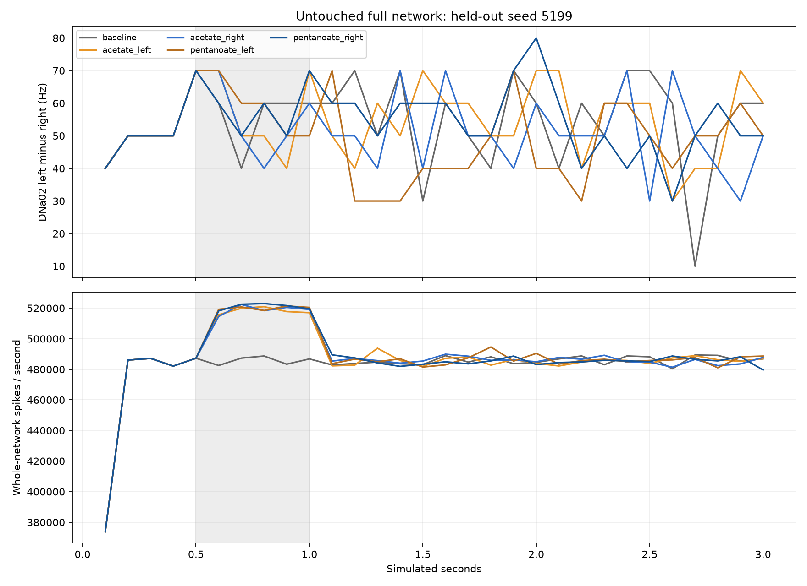
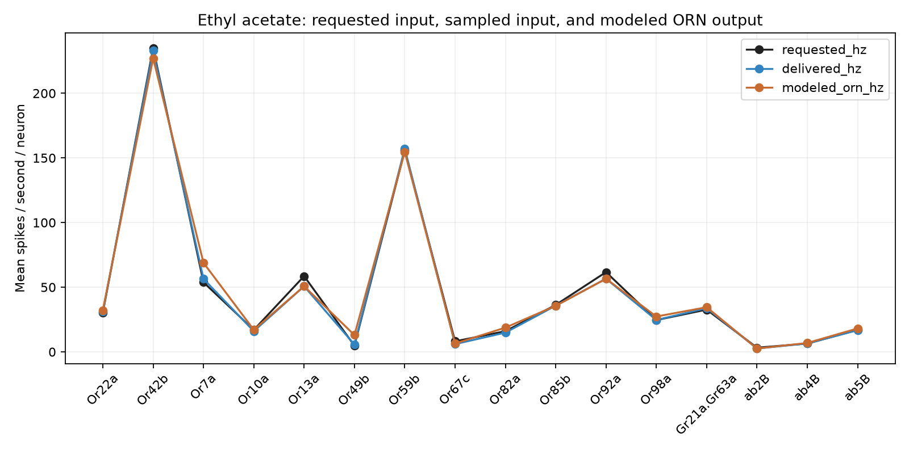

# Step 5 — literature-backed sensory encoding and parameter audit

The measured-rate sensory encoder is implemented and tested in an isolated full network. The preregistered steering gate failed: 1/12 cue/seed comparisons met the criterion. No model was promoted to the arena.

## What changed in the experiment

The [DoOR Bruyne.2001.WT dataset](https://neuro.uni-konstanz.de/DoOR/content/dataset.php?dataset=Bruyne.2001.WT) supplies baseline-subtracted responses and spontaneous firing, mapped through receptor/glomerulus annotations to **751 of 2,275 annotated ORNs**. The complete brain still contains **138,639 neurons and 15,091,983 connection records**. Unmapped sensory populations remain present, with no invented response values.

Sixteen populations receive background firing. Named ethyl acetate and ethyl pentanoate stimuli, plus the oil control, use the measured rates. For example, DM1 uses 9 Hz background and 235 Hz during ethyl acetate exposure; DM2 uses 4 Hz background and 30.308 Hz during that stimulus. Negative response changes reduce background firing. Oil is measured separately because these data do not subtract the solvent response. There is no 100 Hz cap. Stimulated sensory roots use the reference zero-refractory convention; other cells retain 2.2 ms.

Linear exposure interpolation, rectangular 500 ms pulses, bilateral placement and stochastic input timing are engineered choices. These average response values do not supply biological adaptation traces, arena concentration calibration, or complete sensory coverage. Rates describe external events; recurrent modeled ORN spikes can differ.

## Outcome

Three seeds, including the committed held-out seed 5199, covered background, oil left/right, two odors left/right, side switching, quiet and legacy input controls: **33 independent full-network trials**, **99 simulated seconds**, **990 complete chunks**, **42,091,212 raw spikes**. Learning was frozen. All synaptic weights and published intrinsic parameters were retained. A separate 3-second repeat verified deterministic raw recordings; its 30 chunks are retained outside the primary trial total.

Across the named-odor pulse conditions, left DNa02 rates ranged 44.0–62.0 Hz and right rates 0.0–2.0 Hz. The full comparison table in results.json includes each cue versus matched background and versus oil. Mean absolute difference between sampled external rates and modeled ORN output was 2.8 Hz across measured-odor unit/side/seed comparisons; this is a descriptive fidelity diagnostic, not a fit or statistical validation. Recovery is reported relative to firing background, rather than assuming a silent brain.

## Parameter audit and limits

The [published whole-brain model](https://www.nature.com/articles/s41586-024-07763-9) uses the same -52 mV reset, -45 mV threshold, 20 ms membrane constant, 2.2 ms refractory interval, 5 ms synaptic decay, 1.8 ms delay, and 0.275 mV synaptic gain. Step 1 established equation parity with the pinned release. These values were not retuned here. The paper's network release was 630; our imported data are release 783. Its gain was calibrated to feeding response, which does not establish walking calibration.

No supported DNa02- or AOTU019-specific intrinsic replacement was found. The raw archive linked by the [DNa02 physiology paper](https://elifesciences.org/articles/102230) returned HTTP 403 through both attempted public API routes; this prevents a quantitative physiological fit, not completion of this sensory audit. The local table lacks an MN9 annotation needed to reproduce the original feeding calibration.

## Verification and runtime

- All 990 chunks: hashes, raw spike histograms, interval timestamps, exact requested rates, zero-rate input events, full-network counts and frozen learning verified.
- All measured-odor and oil trials exactly match same-seed baseline raw neuron IDs/times and input counts before odor onset.
- Independent held-out ethyl-acetate repetition: all 30 windows exactly match raw spike IDs/times, per-neuron counts, input counts and requested rates. This does not claim full-checkpoint state equivalence.
- Nine targeted encoder and existing steering/decoder checks passed; see tests.log.
- One neural worker at a time; total worker time 759.5 s; maximum process memory 2.31 GiB; simulation throughput 0.130 simulated seconds per wall second, including startup.
- Raw recordings retained. Downloads and recording checks preserve the 2 GiB reserve; no archives were deleted.
- Production brain, decoder, arena and learning rules were not changed.

## Reproduction and next decision

Run `.venv-next/bin/python scripts/prepare_odor_reference.py`, then `.venv-next/bin/python scripts/diagnose_reference_odor.py reports/brain-integration/stage5-20261006`, then `.venv-next/bin/python scripts/diagnose_reference_odor.py reports/brain-integration/stage5-20261006/repeat/acetate_left-5199 --cue acetate_left --seed 5199`, then `.venv-next/bin/python scripts/report_reference_odor.py`. Completed trials are reused only under unchanged source hashes. An incomplete trial is preserved and requires a separate retry directory; it is never overwritten. Input tables are pinned to DoOR.data db323a496577c4b4a72b5c2fcd1859e07521ffb5; hashes and access failures are in retrieval-manifest.json. Derived reference values retain **CC BY-SA 4.0**, attributed to DoOR and de Bruyne et al.; source snapshots are preserved.

Better-supported sensory input alone did not establish reliable sensory steering. The next necessary work is physiological validation of modeled sensory and descending responses, with explicit release-transfer checks; changing inhibition or neuron excitability to obtain attractive movement would not be justified by these results.
