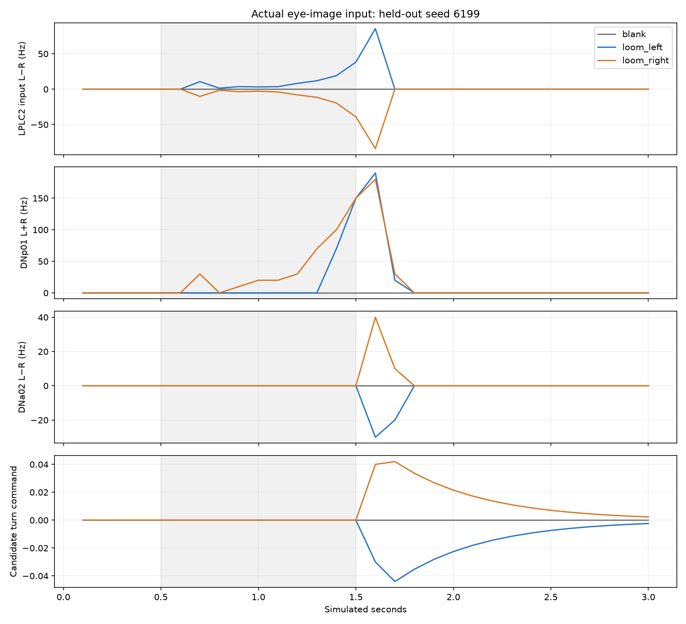

# Step 6 — actual-eye vision integration diagnostic

Actual eye acquisition and an image-only neural adapter are implemented. The full integration gate failed; this profile remains experimental.

## Input and mapping

Verified left/right eye camera orientation using world camera transforms and visible static objects. Inputs are actual fisheye-corrected FlyGym RGB images: two 512×450 eyes. A moving stripe panel, stationary objects, unilateral approaching objects and an approaching wall were rendered in an initialized stationary body pose.

The encoder accepts images and elapsed time only. It measures brightness, absolute image change and positive growth of a dark connected component relative to the initial view. A fixed, bounded engineered gain maps area growth to 0–100 Hz external events. Left/right rates drive all 108 left and 102 right annotated LPLC2 neurons by exact root ID. This bypasses photoreceptor, lamina, medulla and T4/T5 processing; no cell-specific receptive fields or retinotopy are inferred. Brightness and image-change signals are diagnostic readouts, not independent stimulation channels.

The imported table contains 189 direct LPLC2-to-DNp01 connection records representing 1,080 anatomical synapses; exact endpoints and signed counts are retained in lplc2-dnp01-connections.json. These counts do not establish physiological efficacy.

The population choice is supported by [LPLC2 looming research](https://www.nature.com/articles/nature24626). DNp01 is monitored as an annotated downstream population, consistent with its [Giant Fiber classification](https://www.virtualflybrain.org/term/dnp01-vfb_fw036981/); it is not converted into an invented walking escape command. The [published visual-system model](https://www.nature.com/articles/s41586-024-07939-3) required substantial physiological calibration; this adapter does not reproduce that model.

All 138,639 neurons and 15,091,983 connection records remain present. Synaptic weight hashes match before and after every trial. No odor input, tonic walking stimulation, direct descending stimulation, learning, geometric threat proxy or escape reflex is supplied. Stimulated input cells use the reference zero-refractory convention; other cells use 2.2 ms.

Image frames are averaged only after their 100ms acquisition window ends, then delivered in the next neural window. Every source frame precedes its neural window; this introduces an explicit sampling delay without access to future frames.

## Results

27 primary full-network trials across seeds 6101, 6102 and held-out 6199: 81 simulated seconds, 810 chunks and 132,869 raw spikes. A separate held-out repeat adds three seconds and 30 chunks.

Downstream neural gate: **PASS**. Candidate walking-command gate: **FAIL**. Mirrored turning gate: **FAIL**.

| Seed | Cue | Highest downstream mean Hz | Motor RMS change | Mean turn |
|---|---|---:|---:|---:|
| 6101 | left | 23.0 | 0.0067 | -0.0030 |
| 6101 | right | 43.0 | 0.0088 | 0.0048 |
| 6102 | left | 20.0 | 0.0088 | -0.0048 |
| 6102 | right | 42.0 | 0.0088 | 0.0048 |
| 6199 | left | 21.0 | 0.0067 | -0.0030 |
| 6199 | right | 39.0 | 0.0089 | 0.0040 |

[Watch the synchronized actual-eye demonstration](vision-demo.mp4)

## Controls, limitations and body replay

Blanking the eye images removes all encoded stimulation and yields exact raw spike/input/count parity with blank-scene trials on every seed, with zero candidate commands. Every raw spike histogram matches the monitor, all chunk hashes and time intervals pass, and all rates reconstruct from the saved eye features. Features themselves reconstruct from the saved RGB images. Repeating the held-out left loom reproduces every raw spike ID/time, count and input event exactly. Eight focused encoder, timing, mapping and decoder tests passed.

Final-half-second neural recovery: 27/27 primary trials contain zero spikes in the final 500 ms. Background drive is absent in this isolated vision test. Motor smoothing can outlast neural activity and is reported separately.

Mirrored turn signs are consistent on all three seeds, but the committed direction gate also requires mean magnitude above 0.02 in the response window. The magnitude gate is not relaxed after seeing the results. Bilateral DNp09 remains silent during the looming response, so this diagnostic supplies no forward walking drive.

The static-object onset also produces an expansion pulse, and a translating pattern can produce false positives. This is an engineered dark-area growth proxy, not validated LPLC2 selectivity or optical flow. Uniform population stimulation discards retinal location within each eye. Head-fixed sensory recordings isolate the pathway; body replay does not close the sensory loop.

| Replay | Heading change (rad) | Travel (mm) | Falls |
|---|---:|---:|---:|
| blank | -0.000632 | 0.075042 | 0 |
| loom_left | -0.000083 | 0.117989 | 0 |
| loom_right | -0.000326 | 0.105292 | 0 |

Open-loop replay of measured neural motors. Eye inputs were recorded in a stationary pose; replay is not closed-loop navigation or biological escape. Small passive body motion is reported as motion, not success.

All replay poses are finite and each run retains 90 body frames. Small passive movement is not counted as a successful response.

## Runtime and reproducibility

One neural worker at a time. Primary worker time 357.5s; maximum worker memory 2.25 GiB; throughput 0.227 simulated seconds per wall second including startup. Two-GiB free-space reserve checks remain active; no recordings/checkpoints were deleted.

Protocol, root mapping, stimulus hashes, source snapshots, raw chunks, test logs and numeric results are retained beside this report. Rerender and verify existing results with `.venv-next/bin/python scripts/report_eye_brain.py`. Acquisition and body replay refuse existing output folders. For an independent rerun, use a separate project copy with stage6 output absent, then run record_eye_stimuli.py, diagnose_eye_brain.py, the held-out repeat with --cue loom_left --seed 6199 in repeat/loom_left-6199, replay_eye_motor.py and report_eye_brain.py. The neural batch reuses complete trials only under unchanged source hashes; incomplete trials are preserved.

Production controller and application settings remain unchanged. Actual visual input now reaches measured neural circuitry, but the failed integration gates block treating it as reliable visually controlled walking. Further work must address the visual model and appropriate motor pathways rather than adding a hidden escape navigator.
