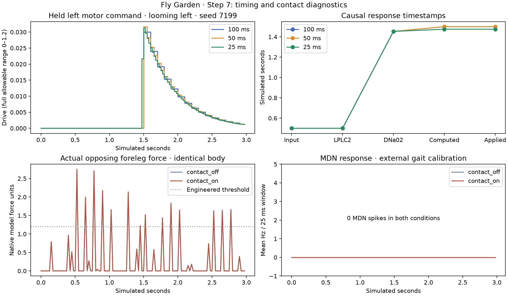

# Step 7 — causal timing and supported body feedback

The experimental full-brain/body pipeline now applies each newly computed motor command in the following physical interval. All 33 three-second trials completed with continuous neural state and unchanged neural weights. Exact neural event streams match across 100, 50 and 25 ms observation windows, and a fresh-process continuation at 1.5 seconds reproduces the remaining neural events, commands, observations, frames and complete physical integration state exactly.

This establishes timing and checkpoint integration. It does not establish useful navigation, escaping or learning. The production controller remains unchanged while the earlier movement gates remain failed.

## What changed

The old loop advanced the brain and then applied its new output to the body over that same time interval. The experimental causal coupler holds the previously available command, advances both systems to the next shared model timestamp, and publishes the successor command for the following interval. No simulated dynamics are skipped when computation is slow. Physics remains 100 microseconds and the supplied gait controller remains 500 microseconds. The selected observation interval is 25 ms, chosen before held-out results rather than fitted to performance.

The experimental body also replaces rounded frame scheduling with a floor-based schedule. Each three-second run records exactly 90 physical poses, within 0.5 ms of their intended 30 Hz timestamps. Observation calculation uses a copy of physical state so it cannot change solver warm starts or gait sensing. A real-body unit test confirms exact physical state and gait-phase agreement across different observation windows for identical held commands.

## Measurements

Held-out left-loom response, seed 7199; values are absolute simulated seconds. Computed and applied timestamps can be equal at a boundary: the command is published at the end of the preceding interval and starts the next interval at that boundary.

| Interval ms | First input event | First LPLC2 spike | First DNa02 spike | First command computed | First command applied |
|---|---|---|---|---|---|
| 100 | 0.5001 | 0.5002 | 1.4535 | 1.5 | 1.5 |
| 50 | 0.5001 | 0.5002 | 1.4535 | 1.5 | 1.5 |
| 25 | 0.5001 | 0.5002 | 1.4535 | 1.475 | 1.475 |

Raw visual input events and all neuron spike IDs/timestamps are exactly identical in all 18 cross-interval comparisons. Interval size changes readout binning, smoothing and when a command becomes available, rather than changing the neural event stream. Vision here replays the actual eye-image recordings from Step 6 at their original 30 Hz timestamps; this is not visually closed-loop navigation. The fly's neural motor commands drive the body in these vision trials.

Across the looming cases, maximum movement departure from matched blank trials is 0.037012 mm, and maximum heading departure is 0.007231 radians. Maximum candidate drive is 0.05695. These are measurements, not successful walking or escape outcomes. Prior Step 6 motor-response failures still apply.

## Contact feedback

The exact local AN_multi_63 roots are 720575940616343441 (left) and 720575940613981330 (right). The institutional [cell-type explorer](https://reiserlab.github.io/celltype-explorer-drosophila-male-cns/types/AN17A026_L.html) identifies the corresponding type as TwoLumps Ascending. [Sen et al. (2019)](https://pubmed.ncbi.nlm.nih.gov/31813606/) reports an anterior-touch retreat pathway involving TLA and MDN. In this imported model, the two selected TLA cells have 8 direct excitatory records totaling 150 anatomical synapses onto four exact-root MDN cells. These cells are typed MDN locally; DNp42 is not substituted.

Only these two of the 2,317 locally annotated ascending/sensory-ascending cells receive neural body-feedback input; this is deliberately limited coverage. The adapter pools opposing horizontal foreleg forces and uses an explicitly engineered 1.2–6 native-model-unit ramp to 0–100 Hz, driving both TLA candidates equally. It does not claim a physiological force-to-rate fit or known left/right receptive fields. Force units are retained as native model units. The measured leg forces are a proxy for anterior contact, not modeled bristles or joint proprioceptors; receptor and ventral-nerve-cord processing are bypassed. Open-ground calibration also produced a 6.53 Hz peak for one seed, so this is not a validated touch classifier.

The contact-on/off trials use the same fixed external .65/.65 walking drive. Complete physical states and held motor commands are exactly identical between each pair, isolating the neural response to actual live forces. Candidate brain commands are recorded but do not control these calibration bodies. MDN activation is inspected; no backward gait has been invented from its firing rate.

| Seed | Peak engineered input Hz | Mean TLA Hz | Mean MDN Hz | Whole-brain spikes |
|---|---|---|---|---|
| 7101 | 21.75 | 0.50 | 0.00 | 3 |
| 7102 | 26.61 | 0.83 | 0.00 | 5 |
| 7199 | 32.29 | 1.67 | 0.00 | 10 |

The contact-on trials produce 18 spikes in the two selected TLA cells and 0 spikes in the four MDN cells. Thus the present encoding has not demonstrated downstream MDN recruitment or retreat. The 25 ms boundary samples can underrepresent brief forces compared with the independent 10 ms preparation; both sampled traces are retained. No gain was changed after seeing held-out results. Contact event integration and physiological calibration need a separate controlled test before a behavioral claim.

Velocity and yaw are recorded as diagnostics. Neural stimulation from speed, turning and joint angles remains disabled because exact-root maps and physiological gains have not been verified. The supplied gait controller's contact corrections remain separately visible.

## Verification and runtime

- Five simulation tests pass: causal command scheduling and clock restore, contact encoding, real-body state/frame invariance, feedback-history continuation, and physical/gait checkpoint continuation at a wall. Two existing browser playback timestamp tests also pass.
- 33 full-network trials: 138,639 neurons and 15,091,983 connection records, fixed weights and learning disabled.
- Every chunk hash, raw spike histogram, external-input count, timing boundary and motor transition verified.
- 18 exact raw-neural cross-interval comparisons; three exact contact-on/off physical comparisons.
- One independent fresh-process full checkpoint continuation: 60 remaining 25 ms windows and 45 remaining 30 Hz frames match exactly, including physical solver state.
- Total primary run time: 898.6 wall seconds for 99 simulated seconds. Peak worker memory: 2.50 GiB. Recording/checkpoint/report storage: 316.9 MiB; remaining disk: 216.8 GiB. The 2 GiB reserve remains enforced.

The neural/body clock has no display camera or playback-speed parameter. Recorded playback changes presentation time only; it cannot change saved commands. This stage does not promote a new live viewer mode. Source hashes, exact-root mappings, raw activity, physical samples and checkpoint files are retained alongside this report.

## Reproduce

Use `.venv-next/bin/python scripts/prepare_timing_feedback.py` for the independent contact preparation, `.venv-next/bin/python scripts/diagnose_causal_timing.py` for the committed sequential batch, and `.venv-next/bin/python scripts/report_causal_timing.py` to verify completed artifacts. Complete runs are retained; interrupted attempts must be preserved before retrying. Full experimental continuation uses the worker's `--resume` option and the exact Stage 7 checkpoint, rather than the production application's checkpoint loader.

Next is Step 8's causal controls. Useful steering, forward drive and biological contact calibration remain unresolved; do not turn these integration checks into a learning or behavior badge.
