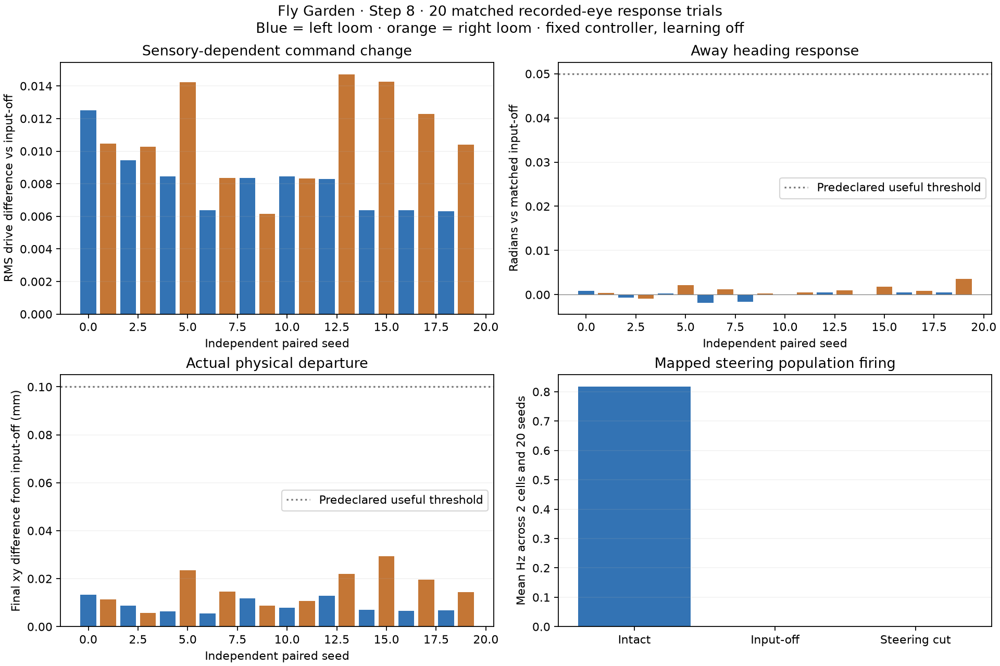

# Step 8 — controlled causality and readiness

The experiment completed 20 new independent input/gait seeds, balanced between ten left and ten right recorded looming cues. Each seed has three continuous full-brain/body runs plus two physical motor controls: 60 full-brain trials and 40 body-only trials. The previously fixed 25 ms coupling, sensory encoding and decoder were not tuned during this experiment. Learning remained disabled.

| Predeclared gate | Result |
|---|---|
| Sensory- and steering-dependent motor effect | PASS |
| Consistent away-directed heading effect | FAIL |
| Useful physical response threshold | FAIL |
| Exact motor replay | PASS |
| Ready for Step 9 behavioral progression | FAIL |

A detectable causal motor effect is distinct from useful avoidance. The result does not establish online visual navigation, predator escape, contact-driven retreat or learning. No experimental controller is promoted into the live arena by this report.

## What the controls do

1. **Intact:** actual eye-image features recorded in Step 6 stimulate exact-root LPLC2 cells, the complete fixed network advances continuously, and DNa02/DNp09 activity produces motor commands through the fixed candidate decoder.
2. **Input-off:** encoded visual rates are zero. Neural parameters, initial neural state, input random-number schedule, gait seed and body remain matched.
3. **Steering interruption:** every incoming anatomical connection onto the two exact-root DNa02 cells has its weight set to zero. The model retains all 138,639 neurons and 15,091,983 connection records. This affects 1493 records containing 25427 anatomical synapses. Every other weight is fixed. Original signed weights, indices and exact pre/post root IDs are saved. This artificial intervention tests the necessity of the mapped steering readout; it does not identify a uniquely biological LPLC2-to-DNa02 route.
4. **Motor replay:** replay the intact trial's held commands in a fresh same-seed physical body. Every complete physical integration state, observed body state and 30 Hz pose matches exactly in all twenty replays.
5. **Zero motor:** reuse the intact neural recording as a labeled body-only counterfactual and apply zero commands to a fresh same-seed body. Every physical state and recorded pose matches the independent full-brain input-off run exactly. The brain is not recomputed for this control.

Intact and interrupted trials receive identical external event IDs/timestamps per seed. Input-off has no external events or neuronal spikes. The interrupted DNa02 cells have no spikes. Raw spike histograms, population rates, every fixed decoder output, causal command boundaries, frame timing, source hashes, connection-mask identity and unchanged weight hashes are independently reconstructed and checked.

## Prechosen effects and uncertainty

Away heading is negative heading change for a left loom and positive heading change for a right loom, with angle unwrapping. It is measured relative to each matched control, rather than counting passive settling as a sensory response. Motor effects use RMS differences between actual applied command timelines. All paired effects are retained, including wrong-way turns, inactive responses, falls and stalls.

The table uses 10,000 paired bootstrap resamples, preserving ten left and ten right seeds, with RNG 8200. Each two-comparison family uses 97.5% percentile intervals for nominal simultaneous 95% coverage by Bonferroni adjustment. Twenty runs provide limited precision; these intervals describe this fixed cue protocol and seed distribution, not a broad claim about fly behavior.

| Paired effect | Mean | 97.5% bootstrap interval |
|---|---|---|
| motor rms vs input off | 0.0095190 | [0.0083419, 0.0106886] |
| motor rms vs steering cut | 0.0095190 | [0.0083419, 0.0106886] |
| away heading vs input off | 0.0004566 | [-0.0000673, 0.0009673] |
| away heading vs steering cut | 0.0004566 | [-0.0000673, 0.0009673] |

The engineered useful-response criterion was saved before the first run: at least 16/20 seeds must gain 0.05 radians of away heading over input-off, at least 16/20 must depart by 0.1 mm from its final xy position, and at least 18/20 must have no flipped frames. Actual counts: **0/20 heading**, **0/20 departure**, **20/20 without flips**. These are progression targets, not biological norms or an escape-success measure.

Maximum final departure from input-off is 0.029292 mm. Mean paired away heading is 0.0004566 radians. There are 1 active-motor stalls under the predeclared definition (RMS drive above 1e-4 and travel below 0.1 mm during 1.5–3 seconds).

## What reaches the movement decoder

Across the twenty intact trials, the selected DNa02 cells emit 98 spikes, DNp09 emits 0 spikes, and the monitored DNp01 visual-response cells emit 1139 spikes. The fixed walking decoder derives forward drive from DNp09 and steering from DNa02; it does not turn DNp01 firing into a walking escape reflex. This separates visually responsive neural activity from the signals this body actually uses. No tonic drive or substituted escape controller was added after observing these runs.

## Scope and next decision

This is a recorded-eye stimulus→brain→command→body causal experiment. The original clips come from the actual physical body's eye cameras, but the stimulated brain does not receive new images from its own changing pose in this stage. Recorded input allows exact event matching and motor counterfactuals; it cannot validate visually closed-loop navigation. Contact-to-brain input is disabled, while the supplied gait controller retains its own contact corrections. The Step 7 touch limitation remains: the existing force proxy did not recruit MDN. No coordinates, route or game score reach this controller.

The brain parameters and learned weights are identical across the twenty initial states; seeds vary stochastic stimulus timing and gait initialization. They are not twenty independently trained animals. No gain, cue timing, interval, outcome threshold or decoder was fitted after reading these results.

Proceeding to navigation requires resolving any failed directional or useful-response gate first. If the causal motor gate passes but the useful gate fails, the evidence supports small activity-dependent movement, not a working foraging brain. Preserve this result rather than adding a hidden navigator, tonic drive or escape rule.

## Runtime and retained evidence

- Complete network: 138,639 neurons, 15,091,983 aggregated connection records, 54,492,922 anatomical synapses before the explicitly recorded intervention.
- 180 simulated seconds of full-brain/body computation. Completed neural-arm wall time: 3845.2 s; body-only control wall time: 780.6 s.
- Peak neural worker memory: 2.75 GiB. Evidence storage: 504.6 MiB. Free disk: 228.6 GiB; the 2 GiB reserve remains enforced.
- Seven focused measurement, physical-state, clock and checkpoint tests passed before the protocol was committed.
- Immutable protocol/source hashes, all-neuron raw spike chunks, external events, body states, 30 Hz poses, per-seed geometry, interrupted edges, motor replays and outcomes remain alongside this report. Interrupted attempts are preserved rather than silently overwritten. The battery shutdown interrupted one input-off attempt; it was archived with its complete chunks and restarted from the same initial protocol state. The seven finished matched seeds and the already complete eighth intact arm were retained without recomputation.

Run `.venv-next/bin/python scripts/diagnose_causal_behavior.py` for the committed sequential batch and `.venv-next/bin/python scripts/report_causal_behavior.py` to audit completed artifacts. Completed cases are retained; existing incomplete cases must be preserved before retrying. `--partial` audits completed seeds without publishing final statistics or pass/fail gates.
